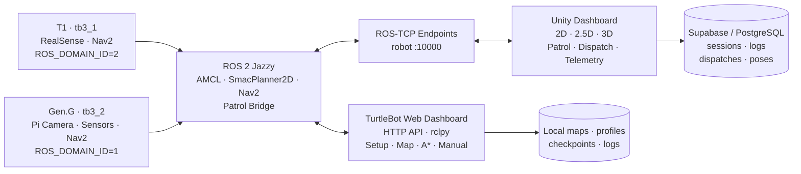
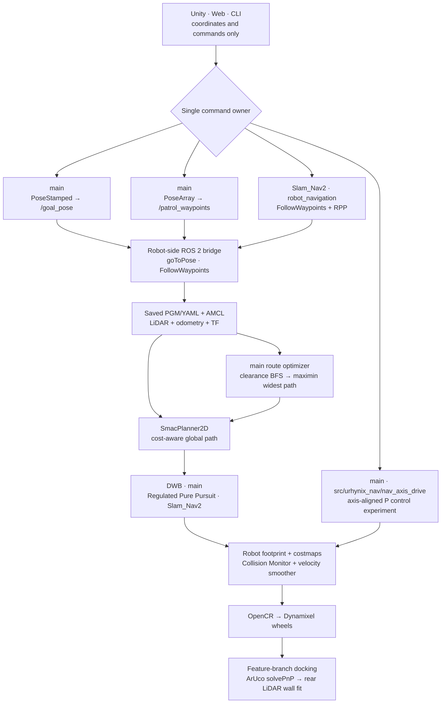
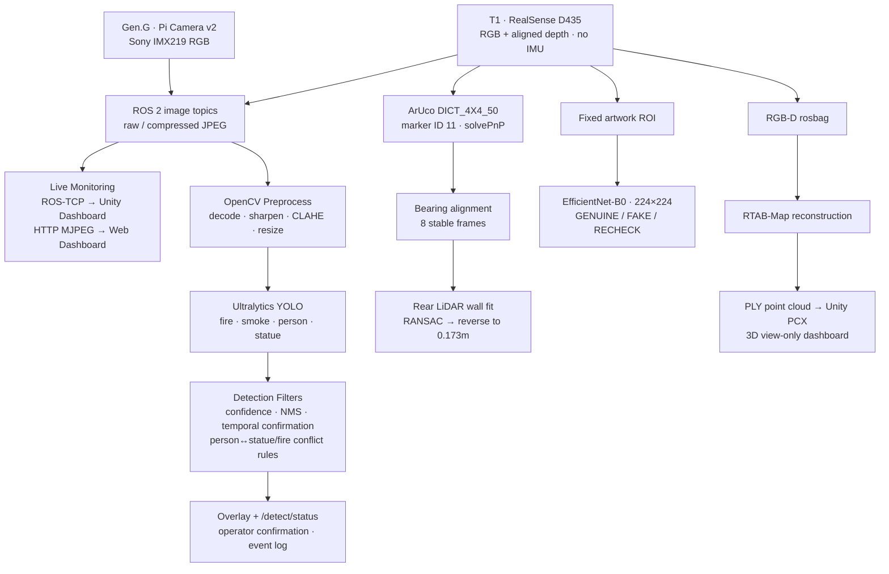

<div align="center">

# URHYNIX-AMR

**Two TurtleBots. One shared map. Two complementary control surfaces.**

ROS 2 자율주행, Web Dashboard 실기 운영, Unity 디지털 트윈, AI 비전과 센서 데이터를 연결한<br>
다중 TurtleBot3 기반 박물관 경비 디지털 트윈 프로젝트

[](https://docs.ros.org/en/jazzy/)
[](https://unity.com/)
[](https://github.com/ensacom2019/TurtleBot_Dashboard)
[](https://nav2.org/)
[](https://emanual.robotis.com/docs/en/platform/turtlebot3/overview/)
[](https://github.com/eduwing-robotics/ros2-ai-amr-repo2/blob/main/LICENSE)

[프로젝트 영상](#project-film) · [한눈에 보기](#한눈에-보기) · [빠른 시작](#quick-start) · [대시보드](#two-dashboards) · [아키텍처](#architecture) · [주행](#driving-navigation--safety) · [비전](#vision-pipeline) · [구현 상태](#implementation-status)

</div>

## 한눈에 보기

URHYNIX-AMR은 **두 대의 TurtleBot3를 하나의 박물관 지도에서 운영**하는 ROS 2 기반 프로젝트입니다. 실제 로봇 주행은 ROS 2/Nav2가 담당하고, Web Dashboard와 Unity Dashboard는 각각 실기 운영과 디지털 트윈 관제를 맡습니다.

| 하고 싶은 일 | 시작 위치 | 참고 |
|---|---|---|
| 로봇을 빌드하고 Nav2 주행하기 | [Quick Start](#quick-start) | 실제 로봇에서는 안전 점검이 먼저 필요합니다. |
| 카메라·YOLO·그림 판별 실행하기 | [Vision_AI/README.md](./Vision_AI/README.md) | T1/Gen.G 카메라 실행 명령을 구분해 안내합니다. |
| T1 또는 Gen.G의 순찰·도킹 실험하기 | [Slam_Nav2/README.md](./Slam_Nav2/README.md) | 로봇별 파라미터와 스크립트를 섞지 마세요. |
| 웹으로 실기 로봇을 제어하기 | [TurtleBot Dashboard](https://github.com/ensacom2019/TurtleBot_Dashboard) | 별도 공개 저장소입니다. |
| Unity 디지털 트윈 열기 | [`UNITY/`](./UNITY/) | ROS-TCP endpoint와 Supabase 설정이 필요할 수 있습니다. |

> [!IMPORTANT]
> 실제 주행 중에는 Web Dashboard, Unity Dashboard, CLI 중 **하나만 command owner**로 사용하세요. 둘 이상의 도구가 `/cmd_vel` 또는 Nav2 목표를 발행하면 로봇 명령이 충돌할 수 있습니다.

## Project Film

<a href="https://youtu.be/WU3v9wZHXu4">
  
</a>

<p align="center">
  <strong>▶ Watch the 2 min 53 sec project film on YouTube</strong><br>
  Physical robots · Web operations · autonomous patrol · ArUco docking · Unity digital twin · AI vision<br>
  <a href="https://youtu.be/WU3v9wZHXu4">Watch on YouTube</a>
</p>

> [!NOTE]
> 실제 로봇 장면과 Unity 시뮬레이션 장면을 함께 사용한 연구·시연 프로젝트입니다.

## Why URHYNIX?

기존 로봇 데모는 주행, 카메라, 관제 화면이 따로 움직이는 경우가 많습니다.<br>
URHYNIX는 두 대의 TurtleBot3가 사용하는 지도와 상태를 TurtleBot Web Dashboard와 Unity Dashboard에 연결합니다. Web Dashboard는 실기 설정과 주행을, Unity Dashboard는 디지털 트윈 관제와 상황 이해를 담당하며 다음 흐름을 함께 완성합니다.

```text
감지 → 위치 확인 → 운영자 판단 → 로봇 출동 → 결과 기록
```

### Team URhynix

<table>
  <tr>
    <td width="50%" valign="top">
      <strong>🧭 김주영 · Project Lead</strong><br><br>
      <code>PM</code> <code>Unity GUI</code> <code>Media</code> <code>AI Tools</code><br><br>
      프로젝트 운영과 발표 영상 제작·편집<br>
      Unity GUI 설계·개발·유지보수<br>
      AI Agent 및 제작 도구 활용
    </td>
    <td width="50%" valign="top">
      <strong>🔧 박태진 · Hardware & Dashboard</strong><br><br>
      <code>Arduino</code> <code>3D Design</code> <code>Dashboard</code> <code>Map</code><br><br>
      Arduino 센서 설정 및 연동<br>
      로봇 부속 기계 3D 설계·출력<br>
      자율주행 Dashboard 설계·개발·유지보수와 맵 디자인
    </td>
  </tr>
  <tr>
    <td width="50%" valign="top">
      <strong>🖥️ 김선일 · GUI & Integration</strong><br><br>
      <code>GUI Coordinates</code> <code>Layout</code> <code>ROS-TCP</code><br><br>
      Unity GUI 좌표 체계와 화면 레이아웃<br>
      관제 UI·ROS-TCP 통신·로봇 통합 협업
    </td>
    <td width="50%" valign="top">
      <strong>🤖 임현찬 · Navigation & Vision</strong><br><br>
      <code>Nav2</code> <code>ArUco</code> <code>YOLO</code> <code>EfficientNet-B0</code><br><br>
      자율주행 및 ArUco 정밀 도킹<br>
      YOLO 비전과 EfficientNet-B0 진품·가품 판별<br>
      맵 세팅과 로봇 부속품 조립
    </td>
  </tr>
</table>

## Highlights

| 기능 | 설명 |
|---|---|
| **Multi-Robot Patrol** | `tb3_1`과 `tb3_2`를 로봇별 ROS 도메인과 endpoint로 분리해 운용 |
| **Autonomous Navigation** | `main`의 AMCL·SmacPlanner2D·DWB와 `Slam_Nav2`의 RPP·ArUco/LiDAR 도킹, 축 정렬 주행 실험 |
| **Safe Patrol Routing** | 점유격자에서 clearance를 계산하고 협소 회랑 중심으로 순찰 경로 생성 |
| **TurtleBot Web Dashboard** | 로봇 검색·설정, 맵 제작, A* 경로, 수동 주행, 카메라·LiDAR, SSH bring-up 제공 |
| **Unity Dashboard** | 2D·2.5D·3D 지도, 로봇 상태, 센서, 카메라, 순찰·출동 제어 제공 |
| **Precision Docking** | ArUco 마커 정렬, 180° 회전, 후방 LiDAR 거리 기반 도킹 |
| **AI Vision Prototypes** | 사람·화재·보호 대상 탐지와 고정 ROI 기반 진위 판정 실험 |
| **Audit Trail** | Supabase에 세션, 로그, 출동, 로봇 위치 기록 |
| **Hardware Validation** | Arduino 센서와 3D 배선 검증 도구를 이용한 실물 연결 전 점검 |

## Two Dashboards

TurtleBot Web Dashboard와 Unity Dashboard는 같은 화면을 복제한 도구가 아닙니다. 하나는 실제 로봇을 빠르게 준비하고 움직이는 운영 콘솔이고, 다른 하나는 다중 로봇과 사건을 공간적으로 이해하는 디지털 트윈입니다.

| | **TurtleBot Web Dashboard** | **Unity Dashboard** |
|---|---|---|
| 핵심 역할 | 실제 TurtleBot의 설정·진단·맵·주행 운영 | 다중 로봇 디지털 트윈·상황 관제·기록 |
| 연결 방식 | Browser ↔ HTTP API ↔ `server.py`/`rclpy` ↔ ROS 2 | Unity ↔ ROS-TCP Endpoint ↔ ROS 2 |
| 지도 | 저장 지도 선택, 벽·장애물 편집, 새 맵 제작 | 2D·2.5D·3D 지도와 로봇 위치 시각화 |
| 주행 | 수동 조작, 목표·경유지, A*, 반복 주행, 중단 지점 재개 | 주행 준비, 순찰 경로, 단발 출동, 정지·복귀 |
| 센서 | LiDAR 안전 반경·회피, odometry, raw/compressed 카메라 | 카메라, LiDAR, 환경 센서, 상태·이벤트 패널 |
| 운영 강점 | SSH bring-up, OpenCR 검증, Nav2 또는 LiDAR direct fallback | 시나리오 재현, 공간 상황 이해, Supabase audit trail |
| 소스 | [`ensacom2019/TurtleBot_Dashboard`](https://github.com/ensacom2019/TurtleBot_Dashboard) | 이 저장소의 [`UNITY/`](./UNITY/) |

### TurtleBot Web Dashboard

별도 공개 저장소인 [`TurtleBot_Dashboard`](https://github.com/ensacom2019/TurtleBot_Dashboard)는 TurtleBot3 Burger와 ROS 2 Jazzy를 위한 로컬 웹 운영 콘솔입니다.

- 로봇 IP·SSH·ROS domain·topic profile을 저장하고 여러 로봇을 검색·선택합니다.
- Setup 화면에서 지도, 벽, 장애물, footprint, 안전 반경과 초기 위치를 설정합니다.
- Map Builder에서 실제 단위와 해상도를 정해 벽을 그리고 지우며 새 점유지도를 만듭니다.
- Driving 화면에서 카메라, LiDAR, robot pose, 계획 경로, 수동 주행과 목표·경유지를 함께 확인합니다.
- 브라우저가 만든 A* 경로를 Nav2 action으로 실행하고, Nav2가 없으면 LiDAR 기반 direct follower로 대체합니다.
- OpenCR USB 장치를 식별하고 ROS 노드·`/odom`·`/cmd_vel`을 검사한 뒤 SSH로 bring-up과 종료를 수행합니다.

### Unity Dashboard

[`UNITY/`](./UNITY/)가 Unity 프로젝트의 공개 정본 경로입니다. 제품명은 **Unity Dashboard**이며, 기존 C# 클래스·씬·namespace의 `ControlRoom*` 이름은 Unity 직렬화 호환성을 위해 유지합니다. 로봇의 위치와 센서, 순찰·출동 흐름을 하나의 공간 안에서 보여주는 Unity 기반 디지털 트윈 대시보드입니다.

- `tb3_1`과 `tb3_2`의 상태를 로봇별 ROS-TCP endpoint로 분리해 수신합니다.
- 같은 박물관 지도를 2D·2.5D·3D로 전환하며 실제 로봇 위치와 경로를 시각화합니다.
- 카메라, LiDAR, PIR·소리·온도·거리 센서와 로봇 상태를 관제 패널에 결합합니다.
- 주행 준비, 순찰 waypoint, 단발 출동 목표, 중지와 복귀 명령을 로봇 bridge에 전달합니다.
- 화재·침입 같은 시뮬레이션 사건을 재현해 감지→확인→출동 흐름을 설명합니다.
- 세션, 이벤트, 출동, 위치를 Supabase에 기록해 시연과 운영 결과를 추적합니다.

> [!IMPORTANT]
> TurtleBot Web Dashboard와 Unity Dashboard가 동시에 `/cmd_vel` 또는 Nav2 목표를 발행하면 명령이 충돌할 수 있습니다. 실제 주행 세션마다 **하나의 화면만 command owner로 선택**하고 다른 화면은 관제용으로 사용하세요.

## Architecture



### Command and data flow

| 방향 | 인터페이스 | 역할 |
|---|---|---|
| Browser ↔ Dashboard | HTTP API | 설정, 맵, 상태, 카메라, 주행 요청 |
| Dashboard ↔ Robot | `rclpy`, ROS topics/actions, SSH | 센서 구독, 수동 주행, Nav2 목표, bring-up |
| Unity Dashboard → Robot | `/<robot>/prepare_drive` | bringup 확인, 위치 초기화, Nav2 활성화 |
| Unity Dashboard → Robot | `/<robot>/patrol_waypoints` | 순찰 경로 전달 |
| Unity Dashboard → Robot | `/<robot>/patrol_stop` | 순찰 중지 후 복귀 |
| Unity Dashboard → Robot | `/<robot>/goal_pose` | 단발 출동 목표 전달 |
| Robot → Unity Dashboard | `/<robot>/pose` | 지도 기준 로봇 위치 |
| Robot → Unity Dashboard | camera / LiDAR / sensor topics | 영상, 스캔, 환경 센서 상태 |
| Unity Dashboard → Supabase | session / log / dispatch / pose writes | 시연 및 운영 기록 |

TurtleBot Web Dashboard는 `server.py`가 브라우저 요청과 ROS 2를 중계합니다. Unity Dashboard의 ROS-TCP는 Nav2 액션을 직접 전달하지 않으며, 로봇 측 `patrol_waypoints_bridge.py`가 Unity 토픽을 받아 Nav2 goal 실행으로 변환합니다.

## Driving, Navigation & Safety

아래 주행 설명은 **이 저장소의 공개 원격 브랜치에 실제로 존재하는 ROS 2/Nav2 코드만** 근거로 작성했습니다. Unity의 `SimNavGrid`, 시나리오 경로 재생, 애니메이션 이동은 실제 로봇 주행 알고리즘으로 계산하지 않습니다. Unity Dashboard와 Web Dashboard는 좌표·명령을 전달하고 상태를 시각화하는 command surface이며, 경로 계획·추종·충돌 판단은 로봇 측 ROS 2 코드가 수행합니다.



### Navigation algorithms

| 단계 | 브랜치 코드에서 확인한 실제 구현 |
|---|---|
| **Localization** | 저장된 `PGM/YAML` 지도에서 AMCL이 LiDAR scan, wheel odometry와 TF를 결합해 `map` 기준 pose를 추정합니다. 독에서 시작할 때는 `/initialpose` 재시딩과 nomotion update로 초기 수렴을 돕습니다. |
| **Patrol route generation** | `main`의 [`patrol_route_optimizer.py`](https://github.com/eduwing-robotics/ros2-ai-amr-repo2/blob/d79535d1270ff9526eca974455a2e03c39e8a2c0/src/urhynix_patrol/patrol_route_optimizer.py)가 점유격자에 clearance field를 만들고, 구역 사이를 maximin **widest path**로 연결합니다. [`patrol_safe_clearance.py`](https://github.com/eduwing-robotics/ros2-ai-amr-repo2/blob/d79535d1270ff9526eca974455a2e03c39e8a2c0/src/urhynix_patrol/patrol_safe_clearance.py)는 벽에 가까운 waypoint를 최소 여유점으로 이동시킵니다. |
| **Global planning** | `main`의 [`patch_nav_params_ns.py`](https://github.com/eduwing-robotics/ros2-ai-amr-repo2/blob/d79535d1270ff9526eca974455a2e03c39e8a2c0/src/urhynix_nav/patch_nav_params_ns.py)는 T1에 SmacPlanner2D, inflation `0.15m`, cost multiplier `1.0`, planner `1Hz`를 적용합니다. [`patch_nav_params_genji.py`](https://github.com/eduwing-robotics/ros2-ai-amr-repo2/blob/d79535d1270ff9526eca974455a2e03c39e8a2c0/src/urhynix_nav/patch_nav_params_genji.py)는 Smac 설치 여부를 확인하고 없으면 NavFn을 유지합니다. |
| **Local control** | `main`은 TurtleBot3 `FollowPath`의 DWB 파라미터를 최대 선속도 `0.12m/s`, 완만한 가감속으로 제한합니다. `Slam_Nav2`의 T1·Gen.G package는 `RegulatedPurePursuitController`와 속도 연동 lookahead `0.20~0.50m`를 사용합니다. |
| **Waypoint patrol** | `Slam_Nav2`의 T1·Gen.G `run_patrol.py`는 Nav2 `FollowWaypoints` action을 사용하고, 첫 waypoint 이후 불필요한 도착 yaw 정렬을 완화해 협소 공간 회전을 줄입니다. |
| **Axis-drive experiment** | `main`의 `src/urhynix_nav/nav_axis_drive/goto_axis.py`는 `ALIGN_X → DRIVE_X → ALIGN_Y → DRIVE_Y` 상태기계와 heading P 제어를 사용합니다. `nav2_goal_v4.py`는 map YAML 기반 좌표 변환, AMCL 가드, 스턱 감지와 탈출을 추가합니다. |
| **Safety envelope** | `main`의 Nav2 패치는 실제 footprint, obstacle·voxel·inflation layers, PolygonStop·Slow·Limit, scan timeout과 velocity smoother를 조정합니다. 이 판단과 `/cmd_vel` 생성은 Unity가 아니라 로봇 측 Nav2에서 수행됩니다. |
| **Recovery and docking** | `main`은 실패 시 local/global costmap을 지우고 `0.12m` 후진한 뒤 재시도합니다. `Slam_Nav2` T1 package의 [`aruco_align_t1.py`](https://github.com/eduwing-robotics/ros2-ai-amr-repo2/blob/Slam_Nav2/robot_navigation/t1_rpp_patrol2_aruco_dock/scripts/aruco_align_t1.py)는 ArUco ID 11을 `solvePnP(IPPE_SQUARE)`로 정렬하고, [`dock_t1_rear_wall.py`](https://github.com/eduwing-robotics/ros2-ai-amr-repo2/blob/Slam_Nav2/robot_navigation/t1_rpp_patrol2_aruco_dock/scripts/dock_t1_rear_wall.py)는 후방 LaserScan 벽선을 맞춘 뒤 후진 도킹합니다. Gen.G package도 동일한 RPP·ArUco/LiDAR 파이프라인을 별도 파라미터로 구성합니다. |

> [!NOTE]
> Unity는 목적 좌표·waypoint·정지 요청을 전달하는 관제 계층입니다. 위 알고리즘 표에는 Unity C# 시뮬레이션 이동 코드와 별도 Web Dashboard의 fallback 제어기를 포함하지 않았습니다.

## Vision Pipeline

비전은 “카메라 한 대에서 AI 결과 하나”가 아니라, 실시간 관제·객체 탐지·정밀 도킹·작품 판정·3D 재구성의 다섯 경로로 나뉩니다.



### Vision methods

| 경로 | 입력 | 방법·알고리즘 | 출력 | 상태 |
|---|---|---|---|---|
| **Dual live camera** | D435와 IMX219 compressed topics | `image_transport`, JPEG, ROS-TCP subscriber, latest-frame MJPEG | 두 로봇 영상과 FPS | ✅ `main` |
| **Museum detection** | T1 RGB frame | Ultralytics YOLO, 보조 person model, class-aware NMS, 연속 프레임 확인, 저해상도 CLAHE·sharpen | box overlay와 `/detect/status` | 🧪 `integration/museum-bacchus` |
| **ArUco alignment** | D435 compressed image + camera info | OpenCV `DICT_4X4_50`, marker ID `11`, IPPE square `solvePnP`; calibration이 없으면 image-center bearing | 목표 bearing 오차와 회전 명령 | 🧪 `Slam_Nav2` |
| **Rear docking** | 후방 ±60° LiDAR points | 600회 RANSAC line fit, 벽 법선 각도 정렬, 거리·각도 폐루프 후진 | 약 `0.173m` 후방 간격 | 🧪 `Slam_Nav2` |
| **Artwork authenticity** | 고정 pose에서 자른 Bacchus ROI | ImageNet pretrained EfficientNet-B0, 224×224, genuine/fake 분류, 확률 차가 작으면 `RECHECK` | `GENUINE` / `FAKE` / `RECHECK` | 🧪 `integration/museum-bacchus` |
| **3D reconstruction** | D435 RGB-D rosbag | RTAB-Map, map↔odom SE(2) alignment, crop·outlier filtering, PLY/PCX import | Unity Dashboard의 orbit 가능한 3D 점군 | 🧪 제한적 검증 |

AI 결과는 경비 판단을 보조하는 증거입니다. 사람·화재·작품 이상을 단독으로 확정하지 않고, 로봇 pose·LiDAR·환경 센서·운영자 확인과 함께 해석합니다.

## Robot Profiles

| 로봇 | ROS namespace | Domain | 주요 카메라·센서 | 역할 |
|---|---|---:|---|---|
| **T1** | `tb3_1` | `2` | RealSense D435 | 비전·자율주행·ArUco 도킹 |
| **Gen.G** | `tb3_2` | `1` | Pi Camera, Arduino sensors | 순찰·센서·ArUco 도킹 |

## Repository Layout

```text
ros2-ai-amr-repo2/
├── src/
│   ├── urhynix_bringup/      # TurtleBot3 and sensor bringup
│   ├── urhynix_nav/          # Nav2, AMCL, maps, navigation parameters
│   ├── urhynix_patrol/       # Route optimization and patrol bridge
│   ├── urhynix_bridge/       # Robot-side Unity↔ROS services
│   ├── urhynix_slam/         # Mapping and scan validation
│   └── urhynix_perception/   # Sensors, ArUco, and perception utilities
├── UNITY/                    # Unity Dashboard source
├── server/                   # Supabase migrations and SQL
├── Arduino/                  # Arduino sketches and wiring references
├── urhynix.repos             # External ROS 2 dependencies
└── README.md
```

Dashboard는 이 저장소의 하위 폴더가 아니라 독립 프로젝트입니다.

```text
TurtleBot_Dashboard/
├── server.py                 # HTTP API, ROS 2 bridge, direct follower
├── web/                      # Setup, Driving, Map Builder UI
├── data/                     # Local profiles, maps, checkpoints, logs
├── tests/                    # Dashboard behavior checks
└── run_ubuntu.sh             # Ubuntu/ROS 2 launcher
```

## Quick Start

### Requirements

- TurtleBot3 with Raspberry Pi and OpenCR
- Ubuntu 24.04 and ROS 2 Jazzy on each robot
- Python 3.10+ for the Web Dashboard
- Unity 6.3 LTS for the digital-twin client
- Robots and control PC on the same network

### 1. Build the ROS 2 workspace

```bash
git clone https://github.com/eduwing-robotics/ros2-ai-amr-repo2.git
cd ros2-ai-amr-repo2

vcs import src < urhynix.repos
rosdep install --from-paths src --ignore-src -r -y
colcon build --symlink-install
source install/setup.bash
```

### 2. Start a robot

```bash
# T1 example
export ROS_DOMAIN_ID=2
bash src/urhynix_bringup/_t1_up.sh

# Prepare localization and Nav2
bash src/urhynix_patrol/t1_drive_ready.sh
```

### 3A. Run the TurtleBot Web Dashboard

```bash
git clone https://github.com/ensacom2019/TurtleBot_Dashboard.git
cd TurtleBot_Dashboard

chmod +x run_ubuntu.sh stop_dashboard.sh stop_robot.sh check_camera.sh
./run_ubuntu.sh
```

브라우저에서 `http://127.0.0.1:8080`을 열고 로봇 profile, ROS domain, 지도와 안전 반경을 먼저 확인합니다. ROS 없이 UI만 살펴볼 때는 Python 3.10+ 환경에서 `python server.py --host 127.0.0.1 --port 8080`으로 offline preview를 실행할 수 있습니다.

### 3B. Open the Unity Dashboard

1. Unity Hub에서 `UNITY/`를 엽니다.
2. `Resources/RosConfig/ros_endpoint.json`에 로봇별 IP와 `10000` 포트를 설정합니다.
3. 필요한 경우 `.gitignore` 대상인 Supabase 설정 파일에 **anon key만** 입력합니다.
4. Play 후 주행준비, 순찰, 단발 출동 기능을 사용합니다.

> [!CAUTION]
> 실제 로봇을 움직이기 전에 배터리, 비상정지, 주변 장애물, 로봇 namespace와 ROS domain을 확인하세요.<br>
> Supabase `service_role` 키를 Unity 클라이언트나 저장소에 넣지 마세요.

## Implementation Status

공개 `main`과 `Slam_Nav2` 통합 브랜치의 경계를 명확히 표시합니다.

| 영역 | 상태 | 근거 |
|---|---|---|
| ROS 2·Nav2·Unity·Supabase 기본 구조 | ✅ `main` | [`main`](https://github.com/eduwing-robotics/ros2-ai-amr-repo2) |
| TurtleBot Web Dashboard | ✅ separate public repo | [`TurtleBot_Dashboard`](https://github.com/ensacom2019/TurtleBot_Dashboard) |
| 저장 지도·AMCL·순찰·복귀 흐름 | ✅ `main` | `src/urhynix_nav`, `src/urhynix_patrol` |
| T1 ArUco 도킹 | 🧪 `Slam_Nav2` | [`robot_navigation/t1_rpp_patrol2_aruco_dock`](https://github.com/eduwing-robotics/ros2-ai-amr-repo2/tree/Slam_Nav2/robot_navigation/t1_rpp_patrol2_aruco_dock) |
| Gen.G ArUco 도킹 | 🧪 `Slam_Nav2` | [`robot_navigation/geng_rpp_patrol_dock`](https://github.com/eduwing-robotics/ros2-ai-amr-repo2/tree/Slam_Nav2/robot_navigation/geng_rpp_patrol_dock) |
| 축 정렬·map-aware Nav2 주행 실험 | ✅ `main` | [`src/urhynix_nav/nav_axis_drive`](./src/urhynix_nav/nav_axis_drive/) |
| 박물관 YOLO finetune·실시간 필터 | 🧪 integration branch | [`integration/museum-bacchus`](https://github.com/eduwing-robotics/ros2-ai-amr-repo2/tree/integration/museum-bacchus) |
| 고정 ROI 진위 판정 | 🧪 integration branch | [`integration/museum-bacchus`](https://github.com/eduwing-robotics/ros2-ai-amr-repo2/tree/integration/museum-bacchus) |
| Unity Dashboard 화재·침입 시나리오 | 🎬 simulation | 프로젝트 영상과 Unity demo scene |

### Scope notes

- AI 모델의 정량 성능을 입증하는 충분한 실환경 벤치마크는 아직 공개하지 않았습니다.
- 진위 판정은 특정 작품과 고정 ROI 조건을 대상으로 한 프로토타입입니다.
- `Slam_Nav2`의 구현은 `main` 통합 상태와 동일하지 않습니다.

## Tools by Layer

| Layer | Algorithms and tools | 역할 |
|---|---|---|
| Robot hardware | TurtleBot3 Burger, Raspberry Pi, OpenCR, LDS LiDAR, Dynamixel | 센서 취득과 차동구동 |
| ROS foundation | ROS 2 Jazzy, DDS domain isolation, TF2, lifecycle nodes | 로봇별 통신 격리와 좌표·노드 상태 관리 |
| Localization | AMCL, wheel odometry, LaserScan, saved `PGM/YAML` map | 지도 기준 실시간 pose 추정 |
| Global planning | Nav2 BT Navigator, SmacPlanner2D, custom clearance/widest-path optimizer | 목표·순찰 경로 생성 |
| Motion control | DWB (`main`), Regulated Pure Pursuit (`Slam_Nav2`), axis-aligned P control (`main`) | 로봇 측 경로 추종과 속도 명령 생성 |
| Safety | global/local costmap, obstacle·voxel·inflation layers, Collision Monitor, velocity smoother | 벽·장애물 감속과 정지 |
| Web operations | Python 3, `rclpy`, HTTP, HTML Canvas, JavaScript Binary Heap A*, MJPEG, SSH/systemd | 설정·진단·맵 제작·실기 주행 |
| Unity Dashboard | Unity 6.3 LTS, C#, UI Toolkit, ROS-TCP-Connector, RenderTexture | 2D·2.5D·3D 관제와 순찰·출동 UI |
| Camera transport | `realsense2_camera`, `camera_ros`, `image_transport`, `cv_bridge`, compressed JPEG | D435·IMX219 영상 수집과 전송 |
| AI vision | OpenCV, Ultralytics YOLO, PyTorch, Torchvision EfficientNet-B0 | 객체 탐지와 고정 ROI 분류 prototype |
| Marker docking | OpenCV ArUco, IPPE `solvePnP`, RANSAC line fitting | 마커 정렬과 후방 벽 정밀 도킹 |
| 3D reconstruction | RealSense RGB-D, rosbag2, RTAB-Map, PLY, Unity PCX | 실제 공간 점군 생성과 3D 시각화 |
| Sensors | Arduino Uno, USB serial, PIR, sound, temperature, distance sensors | 환경 이벤트 수집 |
| Data | Supabase, PostgreSQL, JSONL run logs | 세션·이벤트·출동·pose·주행 결과 기록 |

## Contributing

Issue와 pull request를 환영합니다. 로봇을 실제로 움직이는 변경은 다음 정보를 함께 남겨 주세요.

- 대상 로봇과 ROS domain
- 사용한 지도와 시작 pose
- 실행 명령과 주요 ROS topic
- 성공·실패 로그 또는 영상
- 안전 정지 방법

[Open an issue](https://github.com/eduwing-robotics/ros2-ai-amr-repo2/issues) · [View contributors](https://github.com/eduwing-robotics/ros2-ai-amr-repo2/graphs/contributors)

## License

MIT License. See [LICENSE](https://github.com/eduwing-robotics/ros2-ai-amr-repo2/blob/main/LICENSE).
