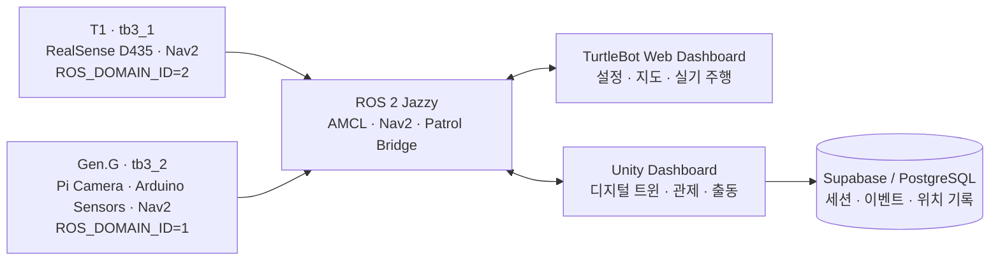
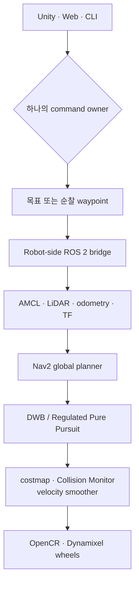
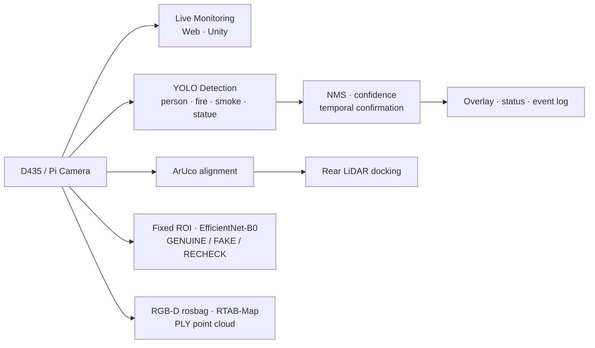

<div align="center">

# URHYNIX-AMR

**두 대의 TurtleBot3, 하나의 박물관 지도, 하나의 관제 흐름**

ROS 2 자율주행 · Web 기반 실기 운영 · Unity 디지털 트윈 · AI 비전 · 환경 센서를 연결한<br>
다중 TurtleBot3 기반 박물관 경비 프로젝트

**프로젝트 기간 · 2026. 05. 25. — 2026. 07. 24.**

[](https://docs.ros.org/en/jazzy/)
[](https://unity.com/)
[](https://nav2.org/)
[](https://emanual.robotis.com/docs/en/platform/turtlebot3/overview/)
[](./LICENSE)

[프로젝트 영상](#프로젝트-영상) · [프로젝트 개요](#프로젝트-개요) · [핵심 기능](#핵심-기능) · [시스템 구성](#시스템-구성) · [팀 소개](#team-urhynix) · [실행하기](#실행하기)

</div>

## 프로젝트 영상

<a href="https://youtu.be/WU3v9wZHXu4">
  
</a>

<p align="center">
  <strong>▶ 2분 53초 프로젝트 영상 보기</strong><br>
  실제 로봇 · 자율 순찰 · 웹 관제 · ArUco 도킹 · Unity 디지털 트윈 · AI 비전<br>
  <a href="https://youtu.be/WU3v9wZHXu4">YouTube에서 보기</a>
</p>

> [!NOTE]
> 실제 로봇 장면과 Unity 시뮬레이션 장면을 함께 사용한 연구·시연 프로젝트입니다.

## 프로젝트 개요

URHYNIX-AMR은 박물관 환경에서 발생할 수 있는 상황을 감지하고, 운영자가 확인한 뒤 로봇을 출동·순찰시키는 흐름을 구현합니다. 두 대의 TurtleBot3는 같은 지도에서 독립적으로 동작하며, Web Dashboard는 실제 로봇 운용을, Unity Dashboard는 공간 기반의 디지털 트윈 관제를 담당합니다.

```text
감지 → 위치 확인 → 운영자 판단 → 로봇 출동 → 결과 기록
```

| 구분 | 내용 |
|---|---|
| **목표** | 실제 AMR과 디지털 트윈을 연결해 다중 로봇 박물관 경비 시나리오를 구현 |
| **운영 대상** | T1(`tb3_1`)과 Gen.G(`tb3_2`) TurtleBot3 Burger 2대 |
| **주행 기반** | ROS 2 Jazzy, AMCL, Nav2, LiDAR, wheel odometry, saved map |
| **관제 화면** | TurtleBot Web Dashboard와 Unity Dashboard |
| **비전·센서** | RealSense D435, Pi Camera, YOLO, EfficientNet-B0, Arduino 환경 센서 |
| **프로젝트 기간** | 2026년 5월 25일 ~ 2026년 7월 24일 |

### 해결하려는 문제

| 문제 | URHYNIX의 접근 |
|---|---|
| 주행·카메라·관제 화면이 각각 분리된 로봇 데모 | ROS 2를 중심으로 실제 로봇, Web Dashboard, Unity Dashboard를 하나의 운용 흐름으로 연결 |
| 여러 로봇의 상태를 공간적으로 파악하기 어려움 | 로봇별 namespace·ROS domain·endpoint를 분리하고 공통 지도 위에서 시각화 |
| 감지 결과가 현장 대응으로 이어지지 않음 | 카메라·환경 센서 이벤트를 운영자 확인, 출동 명령, 기록으로 연결 |
| 시연 후 결과를 추적하기 어려움 | 세션·이벤트·출동·로봇 위치를 Supabase/PostgreSQL에 기록 |

## 핵심 기능

| 기능 | 구현 내용 |
|---|---|
| **다중 로봇 순찰** | `tb3_1`, `tb3_2`를 로봇별 ROS domain·namespace·ROS-TCP endpoint로 분리해 운용 |
| **자율주행과 안전 경로** | AMCL과 Nav2를 이용한 목표 주행·waypoint 순찰, costmap·footprint 기반 충돌 회피 |
| **안전 순찰 경로 생성** | 점유격자에서 clearance를 계산하고, 좁은 회랑의 중앙을 우선하는 waypoint 경로를 생성 |
| **Web 실기 운영** | 로봇 검색·설정, 지도 제작, 카메라·LiDAR 확인, 수동 주행, 목표·경유지 주행, SSH bring-up |
| **Unity 디지털 트윈** | 2D·2.5D·3D 지도, 로봇·센서 상태, 순찰·출동·정지·복귀 흐름을 한 화면에서 관제 |
| **AI 비전** | YOLO 객체 감지, 사람/화재/조각상 필터링, 고정 ROI 기반 Bacchus 그림 진위 판별 |
| **정밀 접근 실험** | ArUco 마커 정렬과 후방 LiDAR 거리 측정을 조합한 도킹 실험 |
| **운영 기록** | 세션, 이벤트, 출동, 위치, 주행 결과를 Supabase/PostgreSQL과 JSONL 로그에 저장 |

> [!IMPORTANT]
> 실제 주행 세션에서는 Web Dashboard, Unity Dashboard, CLI 중 **하나만 command owner**로 사용하세요. 여러 도구가 동시에 `/cmd_vel` 또는 Nav2 목표를 발행하면 명령이 충돌할 수 있습니다.

## 시스템 구성



### 로봇 프로필

| 로봇 | ROS namespace | ROS domain | 카메라·센서 | 주요 역할 |
|---|---|---:|---|---|
| **T1** | `tb3_1` | `2` | RealSense D435 | 비전, 자율주행, ArUco 정렬·도킹 |
| **Gen.G** | `tb3_2` | `1` | Pi Camera, Arduino 환경 센서 | 순찰, 환경 감지, ArUco 정렬·도킹 |

### 명령과 데이터 흐름

| 방향 | 인터페이스 | 역할 |
|---|---|---|
| Web Dashboard ↔ Robot | HTTP API, `rclpy`, ROS topic/action, SSH | 설정, 카메라·센서 구독, 수동 주행, Nav2 목표, bring-up |
| Unity Dashboard → Robot | `/<robot>/prepare_drive`, `/<robot>/patrol_waypoints`, `/<robot>/goal_pose` | 주행 준비, 순찰 경로, 단발 출동 목표 전달 |
| Robot → Unity Dashboard | `/<robot>/pose`, camera/LiDAR/sensor topics | 지도 기준 위치, 영상, 스캔, 환경 센서 상태 전달 |
| Unity Dashboard → Supabase | session/log/dispatch/pose writes | 시연과 운영 결과 저장 |

Unity의 ROS-TCP 계층은 Nav2 action을 직접 실행하지 않습니다. 로봇 측 bridge가 Unity 토픽을 받아 Nav2 goal 또는 waypoint 실행으로 변환합니다.

## 두 대시보드

TurtleBot Web Dashboard와 Unity Dashboard는 같은 UI를 복제한 도구가 아닙니다. 전자는 실제 로봇을 준비하고 움직이는 운영 콘솔이며, 후자는 다중 로봇과 사건을 공간적으로 이해하는 디지털 트윈입니다.

| | **TurtleBot Web Dashboard** | **Unity Dashboard** |
|---|---|---|
| 핵심 역할 | 실제 TurtleBot의 설정·진단·지도·주행 운영 | 다중 로봇 디지털 트윈·상황 관제·기록 |
| 연결 방식 | Browser ↔ HTTP API ↔ `rclpy` ↔ ROS 2 | Unity ↔ ROS-TCP Endpoint ↔ ROS 2 |
| 지도 | 저장 지도 선택, 벽·장애물 편집, 새 점유지도 제작 | 2D·2.5D·3D 지도와 로봇 위치·경로 시각화 |
| 주행 | 수동 조작, 목표·경유지, A* 경로, 반복 주행 | 주행 준비, 순찰 waypoint, 단발 출동, 정지·복귀 |
| 센서 | LiDAR 안전 반경, odometry, raw/compressed 카메라 | 카메라, LiDAR, 환경 센서, 상태·이벤트 패널 |
| 운영 강점 | SSH bring-up, OpenCR 확인, 현장 진단 | 시나리오 재현, 공간 상황 이해, 운영 이력 |
| 소스 | [TurtleBot_Dashboard](https://github.com/ensacom2019/TurtleBot_Dashboard) | 이 저장소의 [`UNITY/`](./UNITY/) |

## 자율주행과 안전

경로 계획·추종·충돌 판단은 Unity나 Web UI가 아닌 **로봇 측 ROS 2 코드**가 수행합니다. 두 대시보드는 좌표와 명령을 전달하고, 상태를 시각화하는 관제 계층입니다.



| 단계 | 구현 내용 |
|---|---|
| **위치 추정** | 저장된 `PGM/YAML` 지도에서 AMCL이 LiDAR scan, wheel odometry, TF를 결합해 `map` 기준 pose를 추정합니다. 시작 시 `/initialpose` 재시딩으로 수렴을 돕습니다. |
| **순찰 경로 생성** | 점유격자에 clearance field를 생성하고, 구역 간 경로는 벽과 장애물에서 더 멀리 떨어지는 widest-path 기준으로 선택합니다. |
| **전역 경로 계획** | Nav2의 SmacPlanner2D 또는 환경에 맞는 planner가 costmap을 고려해 목표 지점까지의 전역 경로를 계산합니다. |
| **로컬 제어** | TurtleBot3의 DWB와 순찰 실험의 Regulated Pure Pursuit가 경로를 추종하며, 속도·가감속·lookahead를 로봇 특성에 맞춰 제한합니다. |
| **안전 계층** | footprint, obstacle/voxel/inflation layer, Collision Monitor, velocity smoother가 벽·장애물 주변 감속과 정지를 담당합니다. |
| **복구와 도킹** | costmap clear, 후진 재시도, map-aware 축 정렬을 수행합니다. 정밀 접근은 ArUco bearing 정렬과 후방 LiDAR 벽 거리 측정을 조합합니다. |

> [!CAUTION]
> 실제 로봇 주행 전 배터리, 비상 정지, 주변 장애물, 로봇 namespace와 ROS domain을 반드시 확인하세요.

## 비전과 AI 파이프라인

비전은 실시간 관제, 객체 탐지, 정밀 도킹, 작품 판별, RGB-D 기반 3D 재구성으로 나뉩니다. AI 결과는 경비 판단을 보조하는 증거이며, 사람·화재·작품 이상을 단독으로 확정하지 않고 로봇 pose·LiDAR·환경 센서·운영자 확인과 함께 해석합니다.



| 경로 | 입력과 방법 | 결과 |
|---|---|---|
| **Dual live camera** | D435·IMX219 compressed topic, `image_transport`, JPEG, ROS-TCP subscriber, MJPEG | 두 로봇의 영상과 FPS를 Web·Unity 관제 화면에 표시 |
| **박물관 객체 감지** | Ultralytics YOLO, person 보조 모델, class-aware NMS, 연속 프레임 확인, CLAHE·sharpen | 사람·화재·연기·조각상 overlay와 감지 상태 |
| **ArUco 정렬** | `DICT_4X4_50`, marker ID, IPPE square `solvePnP`, image-center bearing fallback | 목표 bearing 오차와 회전 명령 |
| **후방 도킹** | 후방 LiDAR 점군의 RANSAC wall fit, 거리·각도 폐루프 | 벽 기준 거리 유지 후진 도킹 |
| **그림 진위 판별** | 고정 pose에서 자른 Bacchus ROI, ImageNet pretrained EfficientNet-B0, 224×224 | `GENUINE` / `FAKE` / `RECHECK` |
| **3D 재구성** | RealSense RGB-D rosbag, RTAB-Map, crop·outlier filtering, PLY/PCX import | Unity Dashboard에서 확인 가능한 3D 점군 |

세부 실행 명령과 모델 재학습 방법은 [Vision_AI/README.md](./Vision_AI/README.md)에 정리했습니다.

## 데이터·하드웨어 연동

| 영역 | 구성 | 역할 |
|---|---|---|
| **로봇 하드웨어** | TurtleBot3 Burger, Raspberry Pi, OpenCR, LDS LiDAR, Dynamixel | 차동구동, LiDAR 취득, odometry |
| **카메라** | RealSense D435, Pi Camera v2 | RGB/RGB-D 스트림, 객체 탐지, 마커 인식 |
| **환경 센서** | Arduino Uno, PIR, 소리, 온도, 거리 센서 | 박물관 상황 이벤트 수집 |
| **운영 데이터** | Supabase, PostgreSQL, JSONL run logs | 세션·이벤트·출동·pose·주행 결과 기록 |
| **3D 제작·검증** | Arduino 배선 참고 자료, 로봇 부속 3D 설계·출력 | 실제 센서와 로봇 부속품 연결 검증 |

## Team URhynix

<table>
  <tr>
    <td width="50%" valign="top">
      <strong>🧭 김주영 · Project Lead</strong><br><br>
      <code>PM</code> <code>Unity GUI</code> <code>Media</code> <code>AI Tools</code><br><br>
      프로젝트 운영과 발표 영상 제작·편집<br>
      Unity GUI 설계·개발·유지보수<br>
      AI Agent 및 제작 도구 활용
    </td>
    <td width="50%" valign="top">
      <strong>🔧 박태진 · Hardware & Dashboard</strong><br><br>
      <code>Arduino</code> <code>3D Design</code> <code>Dashboard</code> <code>Map</code><br><br>
      Arduino 센서 설정 및 연동<br>
      로봇 부속 기계 3D 설계·출력<br>
      자율주행 Dashboard 설계·개발·유지보수와 맵 디자인
    </td>
  </tr>
  <tr>
    <td width="50%" valign="top">
      <strong>🖥️ 김선일 · GUI & Integration</strong><br><br>
      <code>GUI Coordinates</code> <code>Layout</code> <code>ROS-TCP</code><br><br>
      Unity GUI 좌표 체계와 화면 레이아웃<br>
      관제 UI·ROS-TCP 통신·로봇 통합 협업
    </td>
    <td width="50%" valign="top">
      <strong>🤖 임현찬 · Navigation & Vision</strong><br><br>
      <code>Nav2</code> <code>ArUco</code> <code>YOLO</code> <code>EfficientNet-B0</code><br><br>
      자율주행 및 ArUco 정밀 도킹<br>
      YOLO 비전과 EfficientNet-B0 진품·가품 판별<br>
      맵 세팅과 로봇 부속품 조립
    </td>
  </tr>
</table>

## 기술 스택

| 분야 | 사용 기술 |
|---|---|
| 로봇·미들웨어 | TurtleBot3 Burger, Raspberry Pi, OpenCR, ROS 2 Jazzy, TF2, DDS |
| 자율주행 | Nav2, AMCL, SmacPlanner2D, DWB, Regulated Pure Pursuit, costmap |
| 관제·시각화 | Unity 6.3 LTS, C#, ROS-TCP-Connector, Python, `rclpy`, HTTP, MJPEG |
| AI·비전 | OpenCV, Ultralytics YOLO, PyTorch, EfficientNet-B0, ArUco, RealSense, RTAB-Map |
| 데이터·센서 | Supabase, PostgreSQL, Arduino Uno, PIR·소리·온도·거리 센서 |

## 프로젝트 구조와 문서

```text
ros2-ai-amr-repo2/
├── src/
│   ├── urhynix_bringup/     # TurtleBot3 및 센서 bringup
│   ├── urhynix_nav/         # Nav2, AMCL, 지도와 navigation parameter
│   ├── urhynix_patrol/      # 순찰 경로와 Unity↔ROS bridge
│   ├── urhynix_bridge/      # 로봇 측 Unity 연동 서비스
│   ├── urhynix_slam/        # mapping과 scan 검증
│   └── urhynix_perception/  # 센서, ArUco, perception utility
├── UNITY/                   # Unity Dashboard
├── Vision_AI/               # YOLO 및 그림 진위 판별
├── Slam_Nav2/               # 로봇별 순찰·도킹 실험
├── Arduino/                 # 센서 스케치와 배선 참고 자료
├── server/                  # Supabase migration과 SQL
└── urhynix.repos            # 외부 ROS 2 의존성 목록
```

| 더 자세히 보기 | 문서 |
|---|---|
| YOLO 감지·그림 진위 판별 | [Vision_AI/README.md](./Vision_AI/README.md) |
| T1·Gen.G 순찰·도킹 | [Slam_Nav2/README.md](./Slam_Nav2/README.md) |
| 로봇 사양과 통합 메모 | [Vision_AI/ROBOT_SPECS.md](./Vision_AI/ROBOT_SPECS.md) · [team-integration.md](./Vision_AI/docs/team-integration.md) |
| Web Dashboard | [ensacom2019/TurtleBot_Dashboard](https://github.com/ensacom2019/TurtleBot_Dashboard) |

## 실행하기

### 요구 환경

- TurtleBot3, Raspberry Pi, OpenCR
- 각 로봇의 Ubuntu 24.04와 ROS 2 Jazzy
- Web Dashboard용 Python 3.10+
- Unity Dashboard용 Unity 6.3 LTS
- 로봇과 제어 PC가 연결된 동일 네트워크

### 1. ROS 2 workspace 빌드

```bash
git clone https://github.com/eduwing-robotics/ros2-ai-amr-repo2.git
cd ros2-ai-amr-repo2

vcs import src < urhynix.repos
rosdep install --from-paths src --ignore-src -r -y
colcon build --symlink-install
source install/setup.bash
```

### 2. T1 예시 실행

```bash
export ROS_DOMAIN_ID=2
bash src/urhynix_bringup/_t1_up.sh
bash src/urhynix_patrol/t1_drive_ready.sh
```

### 3. 관제 화면 열기

#### TurtleBot Web Dashboard

```bash
git clone https://github.com/ensacom2019/TurtleBot_Dashboard.git
cd TurtleBot_Dashboard

chmod +x run_ubuntu.sh stop_dashboard.sh stop_robot.sh check_camera.sh
./run_ubuntu.sh
```

브라우저에서 `http://127.0.0.1:8080`을 열고 로봇 profile, ROS domain, 지도와 안전 반경을 먼저 확인합니다. ROS 없이 UI만 확인할 때는 `python server.py --host 127.0.0.1 --port 8080`으로 offline preview를 실행할 수 있습니다.

#### Unity Dashboard

1. Unity Hub에서 [`UNITY/`](./UNITY/)를 엽니다.
2. `Resources/RosConfig/ros_endpoint.json`에 로봇별 IP와 포트 `10000`을 설정합니다.
3. 필요한 경우 `.gitignore` 대상인 Supabase 설정 파일에 **anon key만** 입력합니다.
4. Play 후 주행 준비, 순찰, 단발 출동 기능을 사용합니다.

## 구현 범위와 안전 고지

| 영역 | 범위 |
|---|---|
| ROS 2·Nav2·대시보드·데이터 기록 | 실제 로봇과 관제 화면을 연결하는 프로젝트의 중심 기능 |
| ArUco/LiDAR 도킹 | 로봇별 파라미터를 둔 정밀 접근·도킹 실험 |
| YOLO·그림 진위 판별 | 박물관 시나리오를 위한 AI 비전 프로토타입 |
| Unity 사건 시나리오 | 실제 로봇 운용 흐름을 설명·재현하기 위한 디지털 트윈 시뮬레이션 |

- AI 모델의 정량 성능을 입증하는 충분한 실환경 벤치마크는 아직 공개하지 않았습니다.
- 그림 진위 판별은 특정 작품과 고정 ROI 조건을 대상으로 한 프로토타입입니다.
- Unity 클라이언트와 저장소에는 Supabase `service_role` 키를 넣지 마세요.

## License

MIT License. See [LICENSE](./LICENSE).
