<div align="center">

# URHYNIX-AMR

**두 대의 TurtleBot3, 하나의 박물관 지도, 하나의 관제 흐름**

ROS 2 자율주행 · Web 기반 실기 운영 · Unity 디지털 트윈 · AI 비전 · 환경 센서를 연결한<br>
다중 TurtleBot3 기반 박물관 경비 프로젝트

[](https://docs.ros.org/en/jazzy/)
[](https://unity.com/)
[](https://nav2.org/)
[](https://emanual.robotis.com/docs/en/platform/turtlebot3/overview/)
[](./LICENSE)

[팀 구성](#team-urhynix) · [프로젝트 주제](#프로젝트-주제) · [요구사항](#요구사항) · [시스템 구성](#시스템-구성) · [주행](#주행) · [비전](#비전) · [시나리오](#시나리오) · [실행하기](#실행하기)

</div>

## Team URhynix

<table style="width: 100%;" width="100%">
  <tr>
    <td width="50%" valign="top">
      <strong>🧭 김주영 · Project Lead</strong><br><br>
      <code>PM</code> <code>Unity GUI</code> <code>Media</code> <code>AI Tools</code><br><br>
      프로젝트 운영과 발표 영상 제작·편집<br>
      Unity GUI 설계·개발·유지보수<br>
      AI Agent 및 제작 도구 활용
    </td>
    <td width="50%" valign="top">
      <strong>🔧 박태진 · Hardware & Dashboard</strong><br><br>
      <code>Arduino</code> <code>3D Design</code> <code>Dashboard</code> <code>Map</code><br><br>
      Arduino 센서 설정 및 연동<br>
      로봇 부속 기계 3D 설계·출력<br>
      자율주행 Dashboard 설계·개발·유지보수와 맵 디자인
    </td>
  </tr>
  <tr>
    <td width="50%" valign="top">
      <strong>🖥️ 김선일 · GUI & Integration</strong><br><br>
      <code>GUI Coordinates</code> <code>Layout</code> <code>ROS-TCP</code><br><br>
      Unity GUI 좌표 체계와 화면 레이아웃<br>
      관제 UI·ROS-TCP 통신·로봇 통합 협업
    </td>
    <td width="50%" valign="top">
      <strong>🤖 임현찬 · Navigation & Vision</strong><br><br>
      <code>Nav2</code> <code>ArUco</code> <code>YOLO</code> <code>EfficientNet-B0</code><br><br>
      자율주행 및 ArUco 정밀 도킹<br>
      YOLO 비전과 EfficientNet-B0 진품·가품 판별<br>
      맵 세팅과 로봇 부속품 조립
    </td>
  </tr>
</table>

## 프로젝트 주제

**실제 AMR과 디지털 트윈을 연결한 다중 로봇 박물관 경비 시스템**입니다. T1(`tb3_1`)과 Gen.G(`tb3_2`) TurtleBot3 Burger가 같은 박물관 지도에서 독립적으로 순찰·출동하고, Web Dashboard와 Unity Dashboard가 실제 로봇 운용과 공간 기반 관제를 나누어 담당합니다.

<a href="https://youtu.be/WU3v9wZHXu4">
  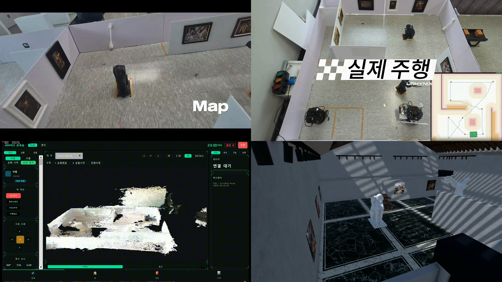
</a>

<p align="center">
  <strong>▶ 2분 53초 프로젝트 영상 보기</strong><br>
  실제 로봇 · 자율 순찰 · 웹 관제 · ArUco 도킹 · Unity 디지털 트윈 · AI 비전<br>
  <a href="https://youtu.be/WU3v9wZHXu4">YouTube에서 보기</a>
</p>

<table style="width: 100%;" width="100%">
  <thead>
    <tr>
      <th width="20%" nowrap style="white-space: nowrap;">구분</th>
      <th>내용</th>
    </tr>
  </thead>
  <tbody>
    <tr>
      <td width="20%" nowrap style="white-space: nowrap;"><strong>운영 대상</strong></td>
      <td>T1(<code>tb3_1</code>)과 Gen.G(<code>tb3_2</code>) TurtleBot3 Burger 2대</td>
    </tr>
    <tr>
      <td width="20%" nowrap style="white-space: nowrap;"><strong>주행 기반</strong></td>
      <td>ROS 2 Jazzy, AMCL, Nav2, LiDAR, wheel odometry, saved map</td>
    </tr>
    <tr>
      <td width="20%" nowrap style="white-space: nowrap;"><strong>관제 화면</strong></td>
      <td>TurtleBot Web Dashboard와 Unity Dashboard</td>
    </tr>
    <tr>
      <td width="20%" nowrap style="white-space: nowrap;"><strong>비전·센서</strong></td>
      <td>RealSense D435, Pi Camera, YOLO, EfficientNet-B0, Arduino 환경 센서</td>
    </tr>
    <tr>
      <td width="20%" nowrap style="white-space: nowrap;"><strong>운영 흐름</strong></td>
      <td>감지 → 위치 확인 → 운영자 판단 → 로봇 출동 → 결과 기록</td>
    </tr>
  </tbody>
</table>

> [!NOTE]
> 실제 로봇 장면과 Unity 시뮬레이션 장면을 함께 사용한 연구·시연 프로젝트입니다.

## 주제 선정 이유

<table style="width: 100%;" width="100%">
  <thead>
    <tr>
      <th>문제</th>
      <th>프로젝트의 접근</th>
    </tr>
  </thead>
  <tbody>
    <tr>
      <td>주행·카메라·관제 화면이 각각 분리된 로봇 데모</td>
      <td>ROS 2를 중심으로 실제 로봇, Web Dashboard, Unity Dashboard를 하나의 운용 흐름으로 연결</td>
    </tr>
    <tr>
      <td>여러 로봇의 상태를 공간적으로 파악하기 어려움</td>
      <td>로봇별 namespace·ROS domain·endpoint를 분리하고 공통 지도 위에서 시각화</td>
    </tr>
    <tr>
      <td>감지 결과가 현장 대응으로 이어지지 않음</td>
      <td>카메라·환경 센서 이벤트를 운영자 확인, 출동 명령, 기록으로 연결</td>
    </tr>
    <tr>
      <td>시연 후 결과를 추적하기 어려움</td>
      <td>세션·이벤트·출동·로봇 위치를 Supabase/PostgreSQL에 기록</td>
    </tr>
  </tbody>
</table>

## 요구사항

기능 범위는 팀이 정의한 사용자·시스템 요구사항을 기준으로 관리했습니다. 요구사항은 `R(Required)`, `D(Desired)`, `O(Optional)`로 구분해 구현 우선순위를 정했습니다.

<table style="width: 100%;" width="100%">
  <thead>
    <tr>
      <th width="24%" nowrap style="white-space: nowrap;">요구 영역</th>
      <th>사용자·시스템 요구사항 반영</th>
    </tr>
  </thead>
  <tbody>
    <tr>
      <td width="24%" nowrap style="white-space: nowrap;"><strong>순찰과 이동</strong></td>
      <td>사전 정의 경로를 반복 순찰하고, 장애물을 인지·회피하며, waypoint 기반 출동과 복귀를 수행</td>
    </tr>
    <tr>
      <td width="24%" nowrap style="white-space: nowrap;"><strong>상태 관제</strong></td>
      <td>관리자가 지도에서 로봇 위치·상태·배터리·센서·카메라·동작 로그를 확인하고 수동 조작 가능</td>
    </tr>
    <tr>
      <td width="24%" nowrap style="white-space: nowrap;"><strong>위험 감지</strong></td>
      <td>사람, 화재, 소음, PIR 등 위험 신호를 수집하고 위치·영상·이벤트를 관제 화면에 전달</td>
    </tr>
    <tr>
      <td width="24%" nowrap style="white-space: nowrap;"><strong>출동과 임무 인계</strong></td>
      <td>T1의 이상 감지 또는 배터리 부족 시 Gen.G에 출동·순찰 인계를 요청</td>
    </tr>
    <tr>
      <td width="24%" nowrap style="white-space: nowrap;"><strong>데이터 기록</strong></td>
      <td>로봇 상태, 센서 이벤트, 출동, 카메라, 위치, 로그를 서버와 DB에 저장</td>
    </tr>
    <tr>
      <td width="24%" nowrap style="white-space: nowrap;"><strong>선택 시연 기능</strong></td>
      <td>그림 진위 판별, 워터 펌프 모의 진압, 디지털 트윈 알림·신고 상태 표시</td>
    </tr>
  </tbody>
</table>

## 시스템 구성

> [!IMPORTANT]
> 실제 주행 세션에서는 Web Dashboard, Unity Dashboard, CLI 중 **하나만 command owner**로 사용하세요. 여러 도구가 동시에 `/cmd_vel` 또는 Nav2 목표를 발행하면 명령이 충돌할 수 있습니다.

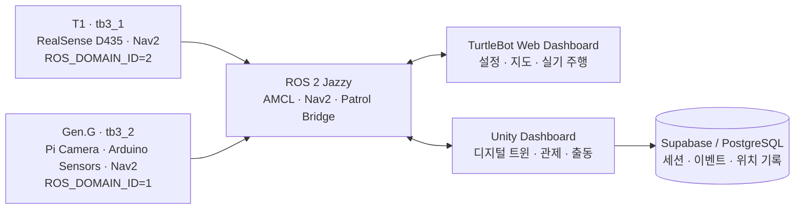

### 하드웨어 아키텍처

두 TurtleBot3에는 공통으로 LiDAR·OpenCR·Dynamixel·배터리를 구성하고, T1에는 RealSense RGB-D 카메라를, Gen.G에는 Pi Camera와 Arduino 환경 센서를 연결했습니다.

<p align="center">
  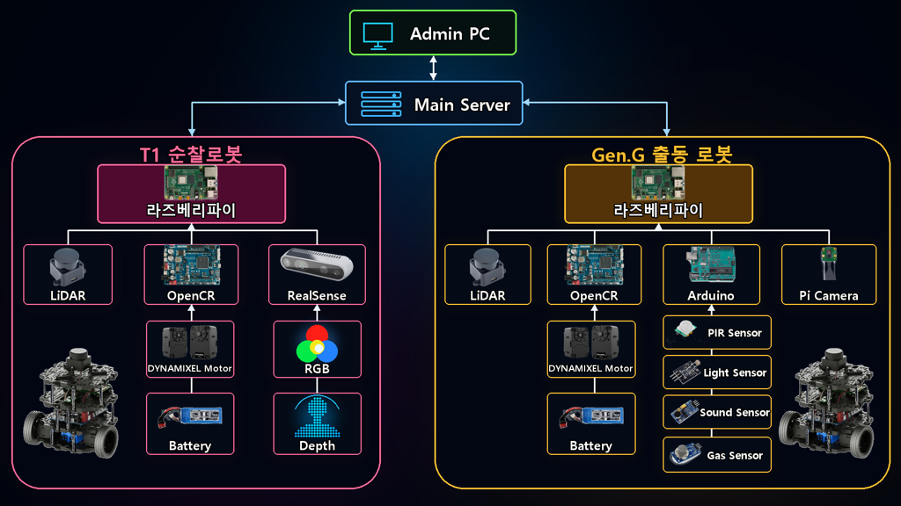
</p>

### 소프트웨어 아키텍처

Admin PC의 Unity 디지털 트윈, 메인 서버의 네트워크·작업·DB·비전 모듈, 두 로봇의 주행·센서 계층을 TCP·UDP·ROS 2 통신으로 연결합니다.

<p align="center">
  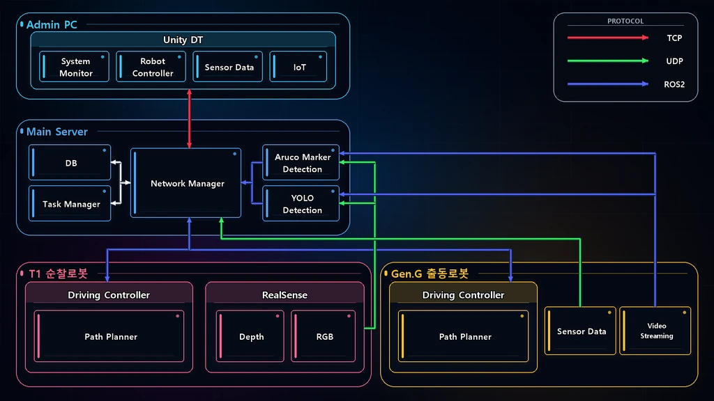
</p>

### 로봇 프로필

<table style="width: 100%;" width="100%">
  <thead>
    <tr>
      <th>로봇</th>
      <th>ROS namespace</th>
      <th>ROS domain</th>
      <th>카메라·센서</th>
      <th>주요 역할</th>
    </tr>
  </thead>
  <tbody>
    <tr>
      <td><strong>T1</strong></td>
      <td><code>tb3_1</code></td>
      <td><code>2</code></td>
      <td>RealSense D435</td>
      <td>비전, 자율주행, ArUco 정렬·도킹</td>
    </tr>
    <tr>
      <td><strong>Gen.G</strong></td>
      <td><code>tb3_2</code></td>
      <td><code>1</code></td>
      <td>Pi Camera, Arduino 환경 센서</td>
      <td>순찰, 환경 감지, ArUco 정렬·도킹</td>
    </tr>
  </tbody>
</table>

### 명령과 데이터 흐름

<table style="width: 100%;" width="100%">
  <thead>
    <tr>
      <th>방향</th>
      <th>인터페이스</th>
      <th>역할</th>
    </tr>
  </thead>
  <tbody>
    <tr>
      <td>Web Dashboard ↔ Robot</td>
      <td>HTTP API, <code>rclpy</code>, ROS topic/action, SSH</td>
      <td>설정, 카메라·센서 구독, 수동 주행, Nav2 목표, bring-up</td>
    </tr>
    <tr>
      <td>Unity Dashboard → Robot</td>
      <td><code>/&lt;robot&gt;/prepare_drive</code>, <code>/&lt;robot&gt;/patrol_waypoints</code>, <code>/&lt;robot&gt;/goal_pose</code></td>
      <td>주행 준비, 순찰 경로, 단발 출동 목표 전달</td>
    </tr>
    <tr>
      <td>Robot → Unity Dashboard</td>
      <td><code>/&lt;robot&gt;/pose</code>, camera/LiDAR/sensor topics</td>
      <td>지도 기준 위치, 영상, 스캔, 환경 센서 상태 전달</td>
    </tr>
    <tr>
      <td>Unity Dashboard → Supabase</td>
      <td>session/log/dispatch/pose writes</td>
      <td>시연과 운영 결과 저장</td>
    </tr>
  </tbody>
</table>
Unity의 ROS-TCP 계층은 Nav2 action을 직접 실행하지 않습니다. 로봇 측 bridge가 Unity 토픽을 받아 Nav2 goal 또는 waypoint 실행으로 변환합니다.

## 데이터·하드웨어 연동

<table style="width: 100%;" width="100%">
  <thead>
    <tr>
      <th width="18%" nowrap style="white-space: nowrap;">영역</th>
      <th>구성</th>
      <th>역할</th>
    </tr>
  </thead>
  <tbody>
    <tr>
      <td width="18%" nowrap style="white-space: nowrap;"><strong>로봇 하드웨어</strong></td>
      <td>TurtleBot3 Burger, Raspberry Pi, OpenCR, LDS LiDAR, Dynamixel</td>
      <td>차동구동, LiDAR 취득, odometry</td>
    </tr>
    <tr>
      <td width="18%" nowrap style="white-space: nowrap;"><strong>카메라</strong></td>
      <td>RealSense D435, Pi Camera v2</td>
      <td>RGB/RGB-D 스트림, 객체 탐지, 마커 인식</td>
    </tr>
    <tr>
      <td width="18%" nowrap style="white-space: nowrap;"><strong>환경 센서</strong></td>
      <td>Arduino Uno, PIR, 소리, 온도, 거리 센서</td>
      <td>박물관 상황 이벤트 수집</td>
    </tr>
    <tr>
      <td width="18%" nowrap style="white-space: nowrap;"><strong>운영 데이터</strong></td>
      <td>Supabase, PostgreSQL, JSONL run logs</td>
      <td>세션·이벤트·출동·pose·주행 결과 기록</td>
    </tr>
    <tr>
      <td width="18%" nowrap style="white-space: nowrap;"><strong>3D 제작·검증</strong></td>
      <td>Arduino 배선 참고 자료, 로봇 부속 3D 설계·출력</td>
      <td>실제 센서와 로봇 부속품 연결 검증</td>
    </tr>
  </tbody>
</table>

## 주행

경로 계획·추종·충돌 판단은 Unity나 Web UI가 아닌 **로봇 측 ROS 2 코드**가 수행합니다. 두 대시보드는 좌표와 명령을 전달하고, 상태를 시각화하는 관제 계층입니다.

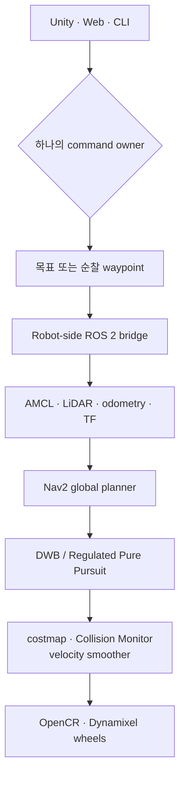

<table style="width: 100%;" width="100%">
  <thead>
    <tr>
      <th width="24%" nowrap style="white-space: nowrap;">단계</th>
      <th>구현 내용</th>
    </tr>
  </thead>
  <tbody>
    <tr>
      <td width="24%" nowrap style="white-space: nowrap;"><strong>위치 추정</strong></td>
      <td>저장된 <code>PGM/YAML</code> 지도에서 AMCL이 LiDAR scan, wheel odometry, TF를 결합해 <code>map</code> 기준 pose를 추정합니다. 시작 시 <code>/initialpose</code> 재시딩으로 수렴을 돕습니다.</td>
    </tr>
    <tr>
      <td width="24%" nowrap style="white-space: nowrap;"><strong>순찰 경로 생성</strong></td>
      <td>점유격자에 clearance field를 생성하고, 구역 간 경로는 벽과 장애물에서 더 멀리 떨어지는 widest-path 기준으로 선택합니다.</td>
    </tr>
    <tr>
      <td width="24%" nowrap style="white-space: nowrap;"><strong>전역 경로 계획</strong></td>
      <td>Nav2의 SmacPlanner2D 또는 환경에 맞는 planner가 costmap을 고려해 목표 지점까지의 전역 경로를 계산합니다.</td>
    </tr>
    <tr>
      <td width="24%" nowrap style="white-space: nowrap;"><strong>로컬 제어</strong></td>
      <td>TurtleBot3의 DWB와 순찰 실험의 Regulated Pure Pursuit가 경로를 추종하며, 속도·가감속·lookahead를 로봇 특성에 맞춰 제한합니다.</td>
    </tr>
    <tr>
      <td width="24%" nowrap style="white-space: nowrap;"><strong>안전 계층</strong></td>
      <td>footprint, obstacle/voxel/inflation layer, Collision Monitor, velocity smoother가 벽·장애물 주변 감속과 정지를 담당합니다.</td>
    </tr>
    <tr>
      <td width="24%" nowrap style="white-space: nowrap;"><strong>복구와 도킹</strong></td>
      <td>costmap clear, 후진 재시도, map-aware 축 정렬을 수행합니다. 정밀 접근은 ArUco bearing 정렬과 후방 LiDAR 벽 거리 측정을 조합합니다.</td>
    </tr>
  </tbody>
</table>

> [!CAUTION]
> 실제 로봇 주행 전 배터리, 비상 정지, 주변 장애물, 로봇 namespace와 ROS domain을 반드시 확인하세요.

## 비전

비전은 실시간 관제, 객체 탐지, 정밀 도킹, 작품 판별, RGB-D 기반 3D 재구성으로 나뉩니다. AI 결과는 경비 판단을 보조하는 증거이며, 사람·화재·작품 이상을 단독으로 확정하지 않고 로봇 pose·LiDAR·환경 센서·운영자 확인과 함께 해석합니다.

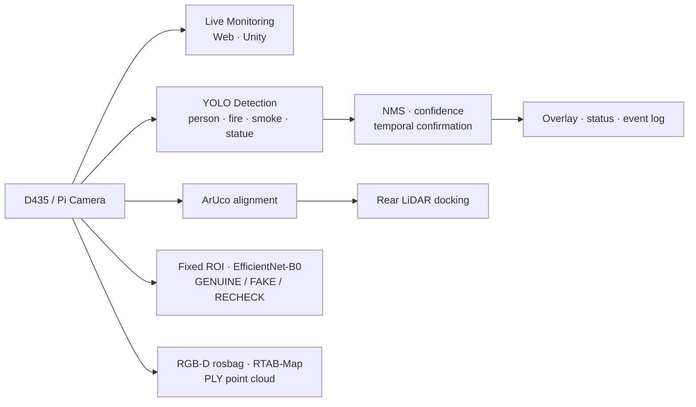

<table style="width: 100%;" width="100%">
  <thead>
    <tr>
      <th width="24%" nowrap style="white-space: nowrap;">경로</th>
      <th>입력과 방법</th>
      <th>결과</th>
    </tr>
  </thead>
  <tbody>
    <tr>
      <td width="24%" nowrap style="white-space: nowrap;"><strong>Dual live camera</strong></td>
      <td>D435·IMX219 compressed topic, <code>image_transport</code>, JPEG, ROS-TCP subscriber, MJPEG</td>
      <td>두 로봇의 영상과 FPS를 Web·Unity 관제 화면에 표시</td>
    </tr>
    <tr>
      <td width="24%" nowrap style="white-space: nowrap;"><strong>박물관 객체 감지</strong></td>
      <td>Ultralytics YOLO, person 보조 모델, class-aware NMS, 연속 프레임 확인, CLAHE·sharpen</td>
      <td>사람·화재·연기·조각상 overlay와 감지 상태</td>
    </tr>
    <tr>
      <td width="24%" nowrap style="white-space: nowrap;"><strong>ArUco 정렬</strong></td>
      <td><code>DICT_4X4_50</code>, marker ID, IPPE square <code>solvePnP</code>, image-center bearing fallback</td>
      <td>목표 bearing 오차와 회전 명령</td>
    </tr>
    <tr>
      <td width="24%" nowrap style="white-space: nowrap;"><strong>후방 도킹</strong></td>
      <td>후방 LiDAR 점군의 RANSAC wall fit, 거리·각도 폐루프</td>
      <td>벽 기준 거리 유지 후진 도킹</td>
    </tr>
    <tr>
      <td width="24%" nowrap style="white-space: nowrap;"><strong>그림 진위 판별</strong></td>
      <td>고정 pose에서 자른 Bacchus ROI, ImageNet pretrained EfficientNet-B0, 224×224</td>
      <td><code>GENUINE</code> / <code>FAKE</code> / <code>RECHECK</code></td>
    </tr>
    <tr>
      <td width="24%" nowrap style="white-space: nowrap;"><strong>3D 재구성</strong></td>
      <td>RealSense RGB-D rosbag, RTAB-Map, crop·outlier filtering, PLY/PCX import</td>
      <td>Unity Dashboard에서 확인 가능한 3D 점군</td>
    </tr>
  </tbody>
</table>
세부 실행 명령과 모델 재학습 방법은 [Vision_AI/README.md](./Vision_AI/README.md)에 정리했습니다.

## 대시보드

TurtleBot Web Dashboard와 Unity Dashboard는 같은 UI를 복제한 도구가 아닙니다. 전자는 실제 로봇을 준비하고 움직이는 운영 콘솔이며, 후자는 다중 로봇과 사건을 공간적으로 이해하는 디지털 트윈입니다.

<table style="width: 100%;" width="100%">
  <thead>
    <tr>
      <th width="14%" nowrap style="white-space: nowrap;"></th>
      <th><strong>TurtleBot Web Dashboard</strong></th>
      <th><strong>Unity Dashboard</strong></th>
    </tr>
  </thead>
  <tbody>
    <tr>
      <td width="14%" nowrap style="white-space: nowrap;">화면</td>
      <td align="center">
        <br>
        <sub>실기 로봇·RViz·카메라를 연결한 Web Dashboard 운영 화면</sub>
      </td>
      <td align="center">
        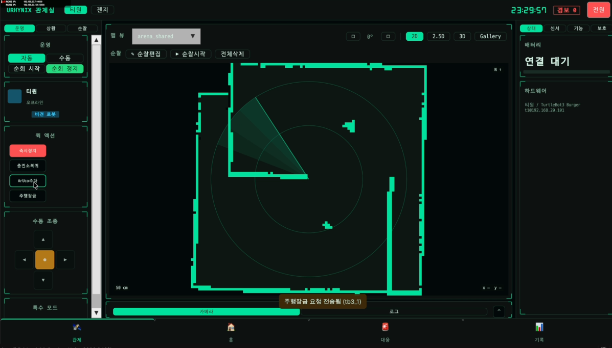<br>
        <sub>박물관 디지털 트윈 기반 Unity Dashboard</sub>
      </td>
    </tr>
    <tr>
      <td width="14%" nowrap style="white-space: nowrap;">핵심 역할</td>
      <td>실제 TurtleBot의 설정·진단·지도·주행 운영</td>
      <td>다중 로봇 디지털 트윈·상황 관제·기록</td>
    </tr>
    <tr>
      <td width="14%" nowrap style="white-space: nowrap;">연결 방식</td>
      <td>Browser ↔ HTTP API ↔ <code>rclpy</code> ↔ ROS 2</td>
      <td>Unity ↔ ROS-TCP Endpoint ↔ ROS 2</td>
    </tr>
    <tr>
      <td width="14%" nowrap style="white-space: nowrap;">지도</td>
      <td>저장 지도 선택, 벽·장애물 편집, 새 점유지도 제작</td>
      <td>2D·2.5D·3D 지도와 로봇 위치·경로 시각화</td>
    </tr>
    <tr>
      <td width="14%" nowrap style="white-space: nowrap;">주행</td>
      <td>수동 조작, 목표·경유지, A* 경로, 반복 주행</td>
      <td>주행 준비, 순찰 waypoint, 단발 출동, 정지·복귀</td>
    </tr>
    <tr>
      <td width="14%" nowrap style="white-space: nowrap;">센서</td>
      <td>LiDAR 안전 반경, odometry, raw/compressed 카메라</td>
      <td>카메라, LiDAR, 환경 센서, 상태·이벤트 패널</td>
    </tr>
    <tr>
      <td width="14%" nowrap style="white-space: nowrap;">운영 강점</td>
      <td>SSH bring-up, OpenCR 확인, 현장 진단</td>
      <td>시나리오 재현, 공간 상황 이해, 운영 이력</td>
    </tr>
    <tr>
      <td width="14%" nowrap style="white-space: nowrap;">소스</td>
      <td><a href="https://github.com/ensacom2019/TurtleBot_Dashboard">TurtleBot_Dashboard</a></td>
      <td>이 저장소의 <a href="./UNITY/"><code>UNITY/</code></a></td>
    </tr>
  </tbody>
</table>

## 시나리오

동작 검증 절차는 침입자 감지, 화재 대응, 배터리 부족 시 임무 인계의 세 시나리오로 구성했습니다. 관제 화면의 신고·제압·진압 표시는 **시연용 상태와 모의 동작**이며, 실제 112/119 신고나 사람을 대상으로 한 물리적 조치를 수행하지 않습니다.

### Scenario #1 · 침입자 감지

T1이 순찰 중 사람을 감지하면 위치·영상을 메인 서버와 관제 화면에 전달합니다. 관제는 112 신고 요청 상태를 표시하고, Gen.G는 감지 위치로 출동합니다. Gen.G 도착 후 T1은 순찰을 재개하며, 상황 종료 시 Gen.G는 대기 장소로 복귀하고 이벤트를 저장합니다.

<p align="center">
  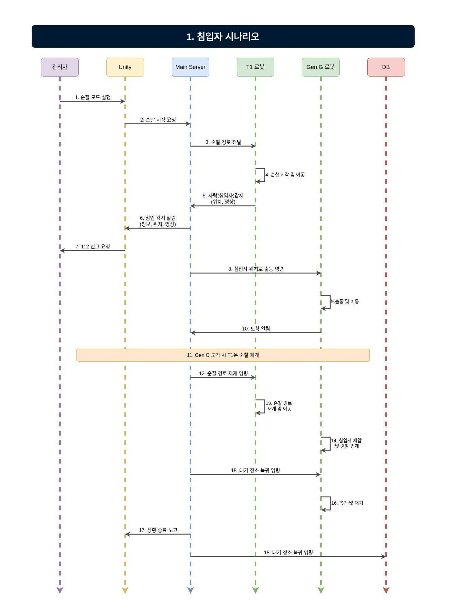
</p>

### Scenario #2 · 화재 대응

T1이 순찰 중 화재 징후를 감지하면 위치·영상을 알리고 Gen.G가 현장으로 출동합니다. Gen.G가 도착하면 T1은 순찰을 재개하며, Gen.G는 워터 펌프를 활용한 **모의 진압** 상태를 수행한 뒤 대기 장소로 복귀합니다. 결과는 DB에 저장됩니다.

<p align="center">
  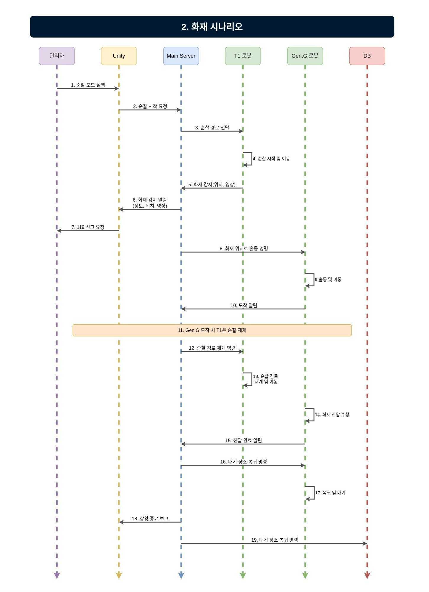
</p>

### Scenario #3 · 배터리 부족과 순찰 임무 인계

T1의 배터리가 30% 이하가 되면 메인 서버가 관제에 위치·잔량을 알립니다. Gen.G가 T1 위치로 이동해 순찰 waypoint를 인계받고, T1은 충전 대기 장소로 이동합니다. 충전 후 T1이 Gen.G 위치로 복귀해 다시 임무를 인계받고 Gen.G는 대기 장소로 돌아갑니다.

<p align="center">
  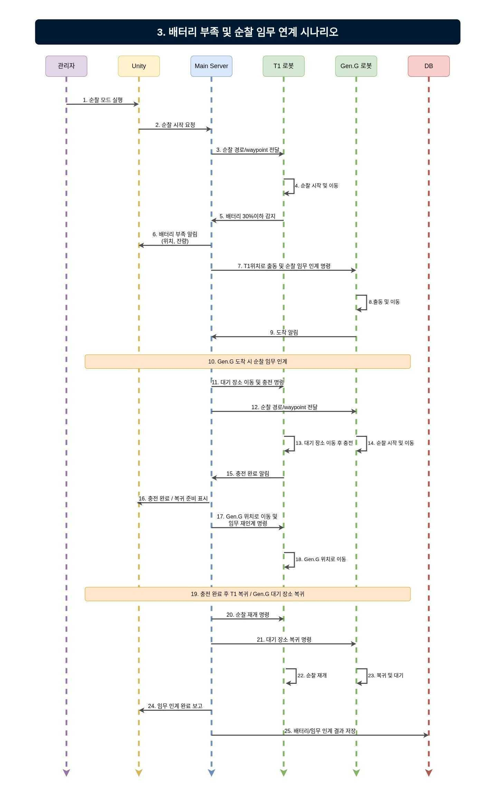
</p>

## 기술 스택

### Robot & Middleware

   

### Navigation

   

### Dashboard & Integration

   

### AI & Vision

    

### Data & Sensors

   
## 일정 관리

**프로젝트 기간 · 2026년 5월 26일 ~ 2026년 7월 24일**

Jira로 요구사항 정의, 설계, ROS 2/SLAM·Nav2, Arduino·센서, Unity 관제, 통합 검증 단계를 스프린트 단위로 관리했습니다.

<p align="center">
  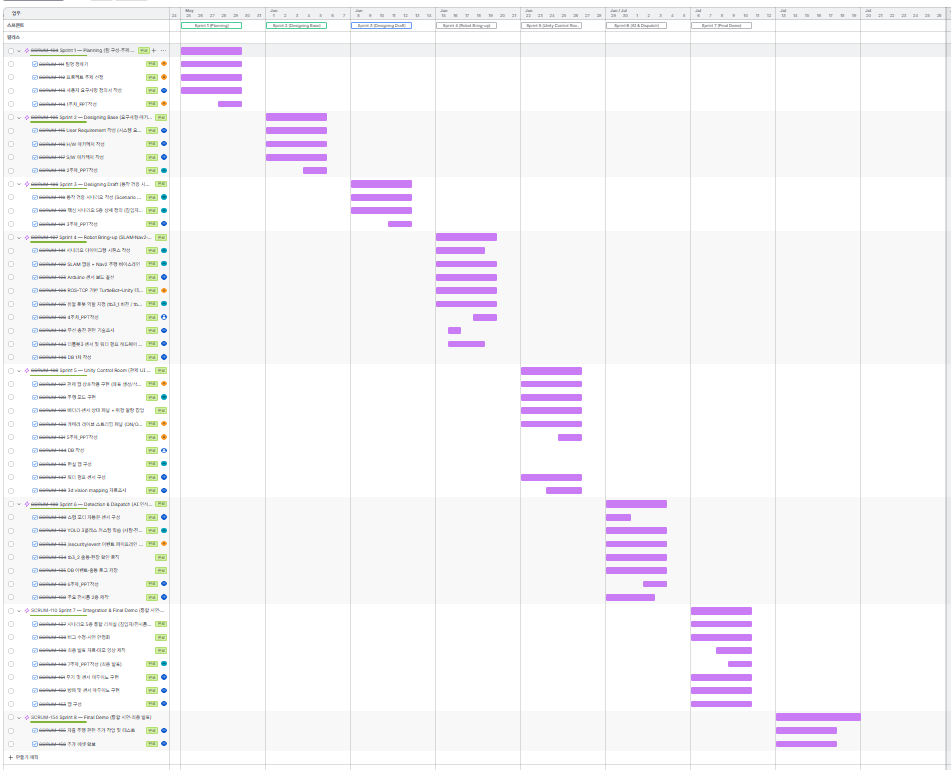
</p>

## 프로젝트 구조와 문서

```text
ros2-ai-amr-repo2/
├── src/
│   ├── urhynix_bringup/     # TurtleBot3 및 센서 bringup
│   ├── urhynix_nav/         # Nav2, AMCL, 지도와 navigation parameter
│   ├── urhynix_patrol/      # 순찰 경로와 Unity↔ROS bridge
│   ├── urhynix_bridge/      # 로봇 측 Unity 연동 서비스
│   ├── urhynix_slam/        # mapping과 scan 검증
│   └── urhynix_perception/  # 센서, ArUco, perception utility
├── UNITY/                   # Unity Dashboard
├── Vision_AI/               # YOLO 및 그림 진위 판별
├── Slam_Nav2/               # 로봇별 순찰·도킹 실험
├── Arduino/                 # 센서 스케치와 배선 참고 자료
├── server/                  # Supabase migration과 SQL
└── urhynix.repos            # 외부 ROS 2 의존성 목록
```

<table style="width: 100%;" width="100%">
  <thead>
    <tr>
      <th width="28%" nowrap style="white-space: nowrap;">더 자세히 보기</th>
      <th>문서</th>
    </tr>
  </thead>
  <tbody>
    <tr>
      <td width="28%" nowrap style="white-space: nowrap;">YOLO 감지·그림 진위 판별</td>
      <td><a href="./Vision_AI/README.md">Vision_AI/README.md</a></td>
    </tr>
    <tr>
      <td width="28%" nowrap style="white-space: nowrap;">T1·Gen.G 순찰·도킹</td>
      <td><a href="./Slam_Nav2/README.md">Slam_Nav2/README.md</a></td>
    </tr>
    <tr>
      <td width="28%" nowrap style="white-space: nowrap;">로봇 사양과 통합 메모</td>
      <td><a href="./Vision_AI/ROBOT_SPECS.md">Vision_AI/ROBOT_SPECS.md</a> · <a href="./Vision_AI/docs/team-integration.md">team-integration.md</a></td>
    </tr>
    <tr>
      <td width="28%" nowrap style="white-space: nowrap;">Web Dashboard</td>
      <td><a href="https://github.com/ensacom2019/TurtleBot_Dashboard">ensacom2019/TurtleBot_Dashboard</a></td>
    </tr>
  </tbody>
</table>

## 실행하기

### 요구 환경

- TurtleBot3, Raspberry Pi, OpenCR
- 각 로봇의 Ubuntu 24.04와 ROS 2 Jazzy
- Web Dashboard용 Python 3.10+
- Unity Dashboard용 Unity 6.3 LTS
- 로봇과 제어 PC가 연결된 동일 네트워크

### 1. ROS 2 workspace 빌드

```bash
git clone https://github.com/eduwing-robotics/ros2-ai-amr-repo2.git
cd ros2-ai-amr-repo2

vcs import src < urhynix.repos
rosdep install --from-paths src --ignore-src -r -y
colcon build --symlink-install
source install/setup.bash
```

### 2. T1 예시 실행

```bash
export ROS_DOMAIN_ID=2
bash src/urhynix_bringup/_t1_up.sh
bash src/urhynix_patrol/t1_drive_ready.sh
```

### 3. 관제 화면 열기

#### TurtleBot Web Dashboard

```bash
git clone https://github.com/ensacom2019/TurtleBot_Dashboard.git
cd TurtleBot_Dashboard

chmod +x run_ubuntu.sh stop_dashboard.sh stop_robot.sh check_camera.sh
./run_ubuntu.sh
```

브라우저에서 `http://127.0.0.1:8080`을 열고 로봇 profile, ROS domain, 지도와 안전 반경을 먼저 확인합니다. ROS 없이 UI만 확인할 때는 `python server.py --host 127.0.0.1 --port 8080`으로 offline preview를 실행할 수 있습니다.

#### Unity Dashboard

1. Unity Hub에서 [`UNITY/`](./UNITY/)를 엽니다.
2. `Resources/RosConfig/ros_endpoint.json`에 로봇별 IP와 포트 `10000`을 설정합니다.
3. 필요한 경우 `.gitignore` 대상인 Supabase 설정 파일에 **anon key만** 입력합니다.
4. Play 후 주행 준비, 순찰, 단발 출동 기능을 사용합니다.

## 구현 범위와 안전 고지

<table style="width: 100%;" width="100%">
  <thead>
    <tr>
      <th width="35%" nowrap style="white-space: nowrap;">영역</th>
      <th>범위</th>
    </tr>
  </thead>
  <tbody>
    <tr>
      <td width="35%" nowrap style="white-space: nowrap;">ROS 2·Nav2·대시보드·데이터 기록</td>
      <td>실제 로봇과 관제 화면을 연결하는 프로젝트의 중심 기능</td>
    </tr>
    <tr>
      <td width="35%" nowrap style="white-space: nowrap;">ArUco/LiDAR 도킹</td>
      <td>로봇별 파라미터를 둔 정밀 접근·도킹 실험</td>
    </tr>
    <tr>
      <td width="35%" nowrap style="white-space: nowrap;">YOLO·그림 진위 판별</td>
      <td>박물관 시나리오를 위한 AI 비전 프로토타입</td>
    </tr>
    <tr>
      <td width="35%" nowrap style="white-space: nowrap;">Unity 사건 시나리오</td>
      <td>실제 로봇 운용 흐름을 설명·재현하기 위한 디지털 트윈 시뮬레이션</td>
    </tr>
  </tbody>
</table>
- AI 모델의 정량 성능을 입증하는 충분한 실환경 벤치마크는 아직 공개하지 않았습니다.
- 그림 진위 판별은 특정 작품과 고정 ROI 조건을 대상으로 한 프로토타입입니다.
- Unity 클라이언트와 저장소에는 Supabase `service_role` 키를 넣지 마세요.

## License

MIT License. See [LICENSE](./LICENSE).
