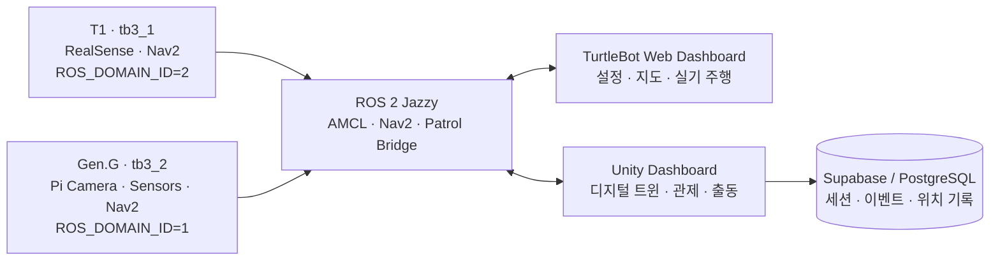

<div align="center">

# URHYNIX-AMR

**두 대의 TurtleBot3, 하나의 박물관 지도, 하나의 관제 흐름**

ROS 2 자율주행 · Web 기반 실기 운영 · Unity 디지털 트윈 · AI 비전 · 환경 센서를 연결한<br>
다중 TurtleBot3 기반 박물관 경비 프로젝트

[](https://docs.ros.org/en/jazzy/)
[](https://unity.com/)
[](https://nav2.org/)
[](https://emanual.robotis.com/docs/en/platform/turtlebot3/overview/)
[](./LICENSE)

[프로젝트 영상](#프로젝트-영상) · [프로젝트 개요](#프로젝트-개요) · [핵심 기능](#핵심-기능) · [시스템 구성](#시스템-구성) · [팀 소개](#team-urhynix) · [실행하기](#실행하기)

</div>

## 프로젝트 영상

<a href="https://youtu.be/WU3v9wZHXu4">
  
</a>

<p align="center">
  <strong>▶ 2분 53초 프로젝트 영상 보기</strong><br>
  실제 로봇 · 자율 순찰 · 웹 관제 · ArUco 도킹 · Unity 디지털 트윈 · AI 비전<br>
  <a href="https://youtu.be/WU3v9wZHXu4">YouTube에서 보기</a>
</p>

> [!NOTE]
> 실제 로봇 장면과 Unity 시뮬레이션 장면을 함께 사용한 연구·시연 프로젝트입니다.

## 프로젝트 개요

URHYNIX-AMR은 박물관 환경에서 발생할 수 있는 상황을 감지하고, 운영자가 확인한 뒤 로봇을 출동·순찰시키는 흐름을 구현합니다. 두 대의 TurtleBot3는 동일한 지도 위에서 독립적으로 동작하며, Web Dashboard는 실제 로봇 운용을, Unity Dashboard는 공간 기반의 디지털 트윈 관제를 담당합니다.

```text
감지 → 위치 확인 → 운영자 판단 → 로봇 출동 → 결과 기록
```

| 해결하려는 문제 | URHYNIX의 접근 |
|---|---|
| 주행·센서·관제 화면이 분리된 로봇 데모 | ROS 2를 중심으로 실제 로봇, Web Dashboard, Unity Dashboard를 연결 |
| 다중 로봇 상태를 한눈에 파악하기 어려움 | 로봇별 namespace·ROS domain·endpoint를 분리하고 공통 지도에서 시각화 |
| 감지 결과를 현장 대응으로 이어가기 어려움 | 카메라·센서 이벤트를 운영자 확인과 순찰·출동 명령으로 연결 |

## 핵심 기능

| 기능 | 설명 |
|---|---|
| **다중 로봇 순찰** | `tb3_1`과 `tb3_2`를 분리된 ROS domain과 endpoint로 운영합니다. |
| **자율주행과 안전 경로** | AMCL·Nav2·costmap을 기반으로 목표 주행과 waypoint 순찰을 수행합니다. |
| **두 개의 관제 화면** | Web Dashboard는 실기 설정·진단·주행을, Unity Dashboard는 디지털 트윈 관제를 맡습니다. |
| **AI 비전** | YOLO 기반 객체 감지와 고정 ROI 기반 그림 진위 판별 프로토타입을 제공합니다. |
| **정밀 접근 실험** | ArUco 마커와 후방 LiDAR를 이용한 정렬·도킹 실험을 포함합니다. |
| **운영 기록** | 세션·이벤트·출동·로봇 위치를 Supabase/PostgreSQL에 기록할 수 있습니다. |

> [!IMPORTANT]
> 실제 주행 세션에서는 Web Dashboard, Unity Dashboard, CLI 중 **하나만 command owner**로 사용하세요. 여러 도구가 동시에 `/cmd_vel` 또는 Nav2 목표를 발행하면 명령이 충돌할 수 있습니다.

## 시스템 구성



| 로봇 | ROS namespace | 주요 장치 | 주 역할 |
|---|---|---|---|
| **T1** | `tb3_1` | RealSense D435 | 비전, 자율주행, ArUco 도킹 |
| **Gen.G** | `tb3_2` | Pi Camera, Arduino 센서 | 순찰, 환경 센서, ArUco 도킹 |

## 두 대시보드

| | **TurtleBot Web Dashboard** | **Unity Dashboard** |
|---|---|---|
| 핵심 역할 | 실제 TurtleBot의 설정·진단·맵·주행 운영 | 다중 로봇 디지털 트윈·상황 관제·기록 |
| 연결 방식 | Browser ↔ HTTP API ↔ `rclpy` ↔ ROS 2 | Unity ↔ ROS-TCP Endpoint ↔ ROS 2 |
| 주요 기능 | 로봇 프로필, 지도 제작, 카메라·LiDAR, 수동/목표 주행 | 2D·2.5D·3D 지도, 로봇 상태, 순찰·출동 제어 |
| 소스 | [TurtleBot_Dashboard](https://github.com/ensacom2019/TurtleBot_Dashboard) | 이 저장소의 [`UNITY/`](./UNITY/) |

## Team URhynix

<table>
  <tr>
    <td width="50%" valign="top">
      <strong>🧭 김주영 · Project Lead</strong><br><br>
      <code>PM</code> <code>Unity GUI</code> <code>Media</code> <code>AI Tools</code><br><br>
      프로젝트 운영과 발표 영상 제작·편집<br>
      Unity GUI 설계·개발·유지보수<br>
      AI Agent 및 제작 도구 활용
    </td>
    <td width="50%" valign="top">
      <strong>🔧 박태진 · Hardware & Dashboard</strong><br><br>
      <code>Arduino</code> <code>3D Design</code> <code>Dashboard</code> <code>Map</code><br><br>
      Arduino 센서 설정 및 연동<br>
      로봇 부속 기계 3D 설계·출력<br>
      자율주행 Dashboard 설계·개발·유지보수와 맵 디자인
    </td>
  </tr>
  <tr>
    <td width="50%" valign="top">
      <strong>🖥️ 김선일 · GUI & Integration</strong><br><br>
      <code>GUI Coordinates</code> <code>Layout</code> <code>ROS-TCP</code><br><br>
      Unity GUI 좌표 체계와 화면 레이아웃<br>
      관제 UI·ROS-TCP 통신·로봇 통합 협업
    </td>
    <td width="50%" valign="top">
      <strong>🤖 임현찬 · Navigation & Vision</strong><br><br>
      <code>Nav2</code> <code>ArUco</code> <code>YOLO</code> <code>EfficientNet-B0</code><br><br>
      자율주행 및 ArUco 정밀 도킹<br>
      YOLO 비전과 EfficientNet-B0 진품·가품 판별<br>
      맵 세팅과 로봇 부속품 조립
    </td>
  </tr>
</table>

## 기술 스택

| 분야 | 사용 기술 |
|---|---|
| 로봇·미들웨어 | TurtleBot3 Burger, Raspberry Pi, OpenCR, ROS 2 Jazzy, TF2, DDS |
| 자율주행 | Nav2, AMCL, SmacPlanner2D, DWB, Regulated Pure Pursuit, costmap |
| 관제·시각화 | Unity 6.3 LTS, C#, ROS-TCP-Connector, Python, `rclpy`, HTTP, MJPEG |
| AI·비전 | OpenCV, Ultralytics YOLO, PyTorch, EfficientNet-B0, ArUco, RealSense |
| 데이터·센서 | Supabase, PostgreSQL, Arduino Uno, PIR·소리·온도·거리 센서 |

## 프로젝트 구조와 문서

```text
ros2-ai-amr-repo2/
├── src/                 # ROS 2 bringup, navigation, patrol, perception, SLAM
├── UNITY/               # Unity Dashboard
├── Vision_AI/           # YOLO 및 그림 진위 판별
├── Slam_Nav2/           # 로봇별 순찰·도킹 실험
├── Arduino/             # 센서 스케치와 배선 참고 자료
├── server/              # Supabase migration과 SQL
└── urhynix.repos        # 외부 ROS 2 의존성 목록
```

| 더 자세히 보기 | 문서 |
|---|---|
| YOLO 감지·그림 진위 판별 | [Vision_AI/README.md](./Vision_AI/README.md) |
| T1·Gen.G 순찰·도킹 | [Slam_Nav2/README.md](./Slam_Nav2/README.md) |
| 로봇 사양과 통합 메모 | [Vision_AI/ROBOT_SPECS.md](./Vision_AI/ROBOT_SPECS.md) · [team-integration.md](./Vision_AI/docs/team-integration.md) |
| Web Dashboard | [ensacom2019/TurtleBot_Dashboard](https://github.com/ensacom2019/TurtleBot_Dashboard) |

## 실행하기

### 요구 환경

- TurtleBot3, Raspberry Pi, OpenCR
- 각 로봇의 Ubuntu 24.04와 ROS 2 Jazzy
- Web Dashboard용 Python 3.10+
- Unity Dashboard용 Unity 6.3 LTS
- 로봇과 제어 PC가 연결된 동일 네트워크

### 1. ROS 2 workspace 빌드

```bash
git clone https://github.com/eduwing-robotics/ros2-ai-amr-repo2.git
cd ros2-ai-amr-repo2

vcs import src < urhynix.repos
rosdep install --from-paths src --ignore-src -r -y
colcon build --symlink-install
source install/setup.bash
```

### 2. T1 예시 실행

```bash
export ROS_DOMAIN_ID=2
bash src/urhynix_bringup/_t1_up.sh
bash src/urhynix_patrol/t1_drive_ready.sh
```

### 3. 관제 화면 열기

- **Web Dashboard:** [TurtleBot_Dashboard](https://github.com/ensacom2019/TurtleBot_Dashboard)의 실행 안내를 따릅니다.
- **Unity Dashboard:** Unity Hub에서 [`UNITY/`](./UNITY/)를 열고, `Resources/RosConfig/ros_endpoint.json`에 로봇 IP와 포트 `10000`을 설정합니다.

## 프로젝트 범위와 안전

- AI 모델의 정량 성능을 입증하는 충분한 실환경 벤치마크는 아직 공개하지 않았습니다.
- 그림 진위 판별은 특정 작품과 고정 ROI 조건을 대상으로 한 프로토타입입니다.
- 실제 로봇을 움직이기 전 배터리, 비상 정지, 주변 장애물, namespace와 ROS domain을 확인하세요.
- Unity 클라이언트와 저장소에는 Supabase `service_role` 키를 넣지 마세요.

## License

MIT License. See [LICENSE](./LICENSE).
