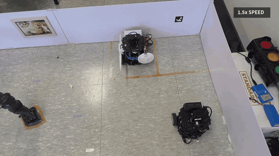

# T1 RPP 순찰×2 · ArUco 도킹 패키지

T1(ROS Domain 2) **시동 / RealSense JPEG 카메라 / RPP 주행 / 순찰 2회 / ArUco 도킹 / 맵**에
필요한 파일만 모아 둔 독립 실행 폴더입니다.

- 로봇: T1 (`192.168.20.101`, `ROS_DOMAIN_ID=2`, ns `tb3_1`)
- 맵: `maps/t1_map_new.{yaml,pgm}`
- Nav2: Smac2D + **RPP** (`config/nav2_params_t1_patrol_rpp.yaml`)
- 마커: ArUco ID **11** (`aruco_markers/markers.yaml`)
- 카메라: RealSense **JPEG compressed** (`/tb3_1/camera/color/image_raw/compressed`)
## 시연 영상

[](media/T1_patrol_twice_docking.mp4)

[전체 영상 보기 (MP4)](media/T1_patrol_twice_docking.mp4)

---

## 실행 순서

노트북에서 `cd Slam_Nav2/t1_rpp_patrol2_aruco_dock` 후 진행합니다.
(터미널마다 `source scripts/env.sh` 또는 아래처럼 `ROBOT=t1`로 스크립트를 실행하면 Domain 2가 잡힙니다.)

### 1) 로봇 bringup (T1 본체)

로봇에서 기존 bringup을 켭니다. (예: `robot_project`의 `robot_bringup_all.sh start t1`)

확인:

```bash
ROBOT=t1 source scripts/env.sh
ros2 topic echo /scan --once
ros2 topic echo /odom --once
```

### 2) RealSense JPEG 카메라 (T1 본체)

ArUco 정렬은 **ROS JPEG compressed** 토픽이 필요합니다.

```bash
# T1 로봇에서 (robot_project 권장)
cd ~/workspace/robot_project
./scripts/launch_t1_realsense.sh
```

노트북에서 확인:

```bash
ROBOT=t1 source scripts/env.sh
ros2 topic echo /tb3_1/camera/color/image_raw/compressed --once
```

### 3) Nav2 RPP (노트북 터미널 1)

```bash
cd Slam_Nav2/t1_rpp_patrol2_aruco_dock
ROBOT=t1 ./scripts/go_nav2_t1_rpp.sh
```

- Ctrl+C 로 Nav2를 종료합니다.
- 기본: raw odom TF (`USE_LOCAL_ODOM_TF=0`, `USE_SCAN_NORM=0`).

### 4) RViz + 2D Pose Estimate (노트북 터미널 2)

```bash
ROBOT=t1 ./scripts/nav2_rviz.sh
```

1. Fixed Frame = `map`
2. 로봇을 정지시킨 뒤 **2D Pose Estimate**로 실제 위치·방향 지정
3. 초록 파티클이 로봇 근처에 모이고, LaserScan이 벽과 겹치는지 확인
4. 필요하면 짧은 **Nav2 Goal**로 주행 테스트

### 5) 순찰 2회 + ArUco 도킹 (노트북 터미널 3)

ArUco 디버그 뷰어가 열려 있으면 **먼저 닫으세요**. (카메라 토픽 점유 충돌 방지)

```bash
ROBOT=t1 ./scripts/run_t1_patrol2_aruco_dock.sh
```

내부 순서:

| 단계 | 내용 |
|------|------|
| 1–2 | `run_patrol.py` × 2 (`config/waypoints.yaml` 순찰점) |
| 3 | `park_t1.py --aruco-stage` (ArUco 대기 위치) |
| 4 | `aruco_align_t1.py` (JPEG, ID 11, target bearing ≈ 3.9°) |
| 5 | `rotate_t1_precise.py` (정밀 180°) |
| 6 | `dock_t1_rear_wall_long.py` (후방 라이다 저속 도킹) |

성공 시: `[OK] 순찰 2회 및 T1 도킹 완료`

---

## 단계별만 실행하고 싶을 때

```bash
ROBOT=t1 source scripts/env.sh

# 순찰 1회만
python3 scripts/run_patrol.py

# ArUco 스테이지만
python3 scripts/park_t1.py --aruco-stage

# ArUco 정렬만 (카메라 토픽 필수)
python3 scripts/aruco_align_t1.py \
  --marker-id 11 --marker-size 0.05 --target-bearing-deg 3.9 \
  --cmd-topic /cmd_vel_nav \
  --image-topic /tb3_1/camera/color/image_raw/compressed \
  --camera-info-topic /tb3_1/camera/color/camera_info

# 180° + 후방 도킹
python3 scripts/rotate_t1_precise.py --ros-args -r /cmd_vel:=/cmd_vel_nav
python3 scripts/dock_t1_rear_wall_long.py --ros-args -r /cmd_vel:=/cmd_vel_nav
```

---

## 폴더 구성

```
t1_rpp_patrol2_aruco_dock/
  README.md                 # 이 사용법
  media/                    # 시연 영상
  scripts/                  # env, Nav2, 순찰, ArUco, 도킹, 카메라 참고
  config/                   # nav2_params_t1_patrol_rpp.yaml, waypoints.yaml
  maps/                     # t1_map_new
  launch/                   # standalone Nav2 bringup (museum_nav_bringup 설치 불필요)
  rviz/
  aruco_markers/            # markers.yaml (+ ID11 이미지)
  behavior_trees/
```

---

## 스크립트 목록과 사용법

노트북에서 `cd Slam_Nav2/t1_rpp_patrol2_aruco_dock` 후, 보통 `ROBOT=t1` 을 붙입니다.
(터미널마다 Domain 2가 잡히도록 `source scripts/env.sh` 또는 스크립트가 내부에서 source)

### 자주 쓰는 것 (권장 순서)

| 스크립트 | 역할 | 사용법 |
|----------|------|--------|
| `go_nav2_t1_rpp.sh` | Nav2 **RPP** 기동 | `ROBOT=t1 ./scripts/go_nav2_t1_rpp.sh` |
| `nav2_rviz.sh` | RViz + Pose Estimate | `ROBOT=t1 ./scripts/nav2_rviz.sh` |
| `run_patrol.py` | 웨이포인트 순찰 1회 | `ROBOT=t1 python3 scripts/run_patrol.py` |
| `run_t1_patrol2_aruco_dock.sh` | **순찰 2회 → ArUco 도킹** 한 줄 | `ROBOT=t1 ./scripts/run_t1_patrol2_aruco_dock.sh` |
| `park_t1.py` | 대기 / ArUco stage 주차 | `python3 scripts/park_t1.py` 또는 `--aruco-stage` |
| `aruco_align_t1.py` | JPEG ArUco 몸체 각도 정렬 (ID 11) | 아래 단계별 예시 참고 |
| `rotate_t1_precise.py` | odom 상대 정밀 180° | `python3 scripts/rotate_t1_precise.py --ros-args -r /cmd_vel:=/cmd_vel_nav` |
| `dock_t1_rear_wall_long.py` | 후방 라이다 저속 도킹 | `python3 scripts/dock_t1_rear_wall_long.py --ros-args -r /cmd_vel:=/cmd_vel_nav` |
| `launch_t1_realsense.sh` | RealSense JPEG 카메라 (로봇에서) | 로봇: `./scripts/launch_t1_realsense.sh` |
| `stop_all_t1.sh` | YOLO/Nav2/RViz/카메라/bringup 전부 종료 | `./scripts/stop_all_t1.sh` |

### 카메라 · YOLO (노트북)

RealSense는 **로봇**에서 `launch_t1_realsense.sh` 로 켭니다.
노트북 YOLO 화면은 `robot_project` 쪽 뷰어를 씁니다 (이 패키지에 YOLO 모델은 없음):

```bash
# 로봇 카메라 토픽 확인
ROBOT=t1 source scripts/env.sh
ros2 topic hz /tb3_1/camera/color/image_raw/compressed

# YOLO + 화면 (robot_project)
cd ~/workspace/robot_project
source scripts/setup_ros_env.sh
export ROS_DOMAIN_ID=2
export ROS_STATIC_PEERS="192.168.20.101;$(hostname -I | awk '{print $1}');127.0.0.1"
python3 scripts/robot_yolo_viewer.py \
  --camera-topic /tb3_1/camera/color/image_raw/compressed \
  --model models/museum_fire_smoke.pt \
  --person-model yolov8n.pt
```

### 내부/보조 스크립트

| 스크립트 | 역할 | 비고 |
|----------|------|------|
| `env.sh` | Domain/DDS/peers | 다른 스크립트가 source |
| `_common.sh` | 공통 유틸 (로컬 ROS 정리 등) | |
| `go_nav2.sh` | Nav2 본체 런처 | `go_nav2_t1_rpp.sh`가 호출 |
| `_nav2_wait_ready.sh` | Nav2 ready 대기 | go_nav2 내부 |
| `odom_tf_relay.py` | 로컬 odom TF 릴레이 | `USE_LOCAL_ODOM_TF=1` 일 때만 |
| `scan_normalize.py` | scan 재스탬프 | `USE_SCAN_NORM=1` 일 때만 (기본 0) |
| `aruco_marker_config.py` | `markers.yaml` 로더 | |

### 전체 종료

```bash
./scripts/stop_all_t1.sh      # YOLO 창 + Nav2 + RViz + RealSense + bringup
```

`stop_*` 는 노트북의 `~/workspace/robot_project/scripts/ssh_t1.py`,
`robot_bringup_all.sh` 가 필요합니다.

---

## 주의사항

1. **Domain**: T1은 `ROS_DOMAIN_ID=2`. Gen.G(1)와 동시에 노트북에서 섞지 마세요.
2. **Pose Estimate**: 순찰/도킹 전에 LaserScan이 맵 벽에 맞게 잠겼는지 확인하세요.
3. **중단**: `Ctrl+C`로 멈추면 `/cmd_vel_nav`에 0 속도가 나가도록 스크립트가 정리합니다. 멈춘 뒤에도 움직이면 수동으로 zero pub 하세요.
4. **경로**: 이 폴더만 있으면 됩니다. `museum_nav_ws` 설치가 없어도 `go_nav2_t1_rpp.sh`가 BT XML 경로를 런타임에 치환합니다.

---

## 캘리브레이션 (검증된 값)

- `waiting.t1_aruco_stage`: `waypoints.yaml` 참고
- ArUco ID **11**, `target_bearing_deg: 3.9`
- 이미지 토픽: `/tb3_1/camera/color/image_raw/compressed`
