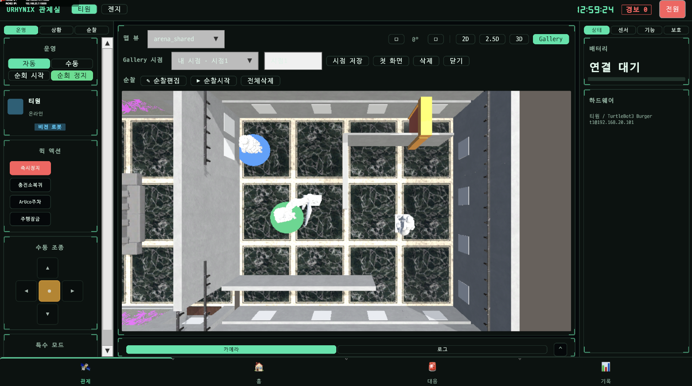
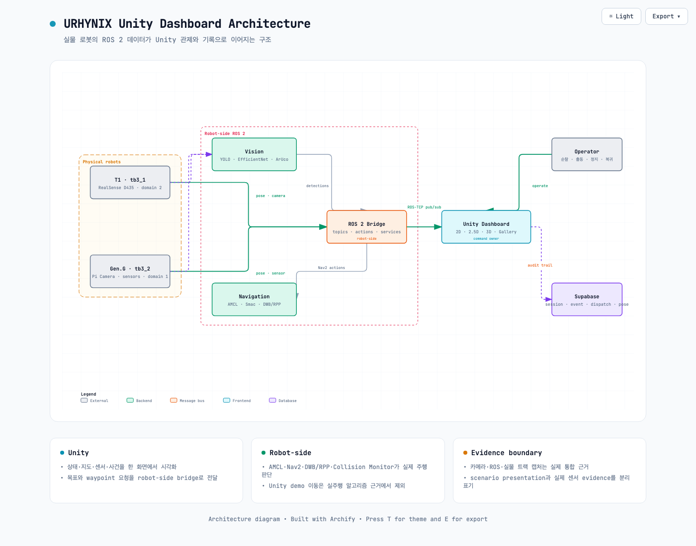
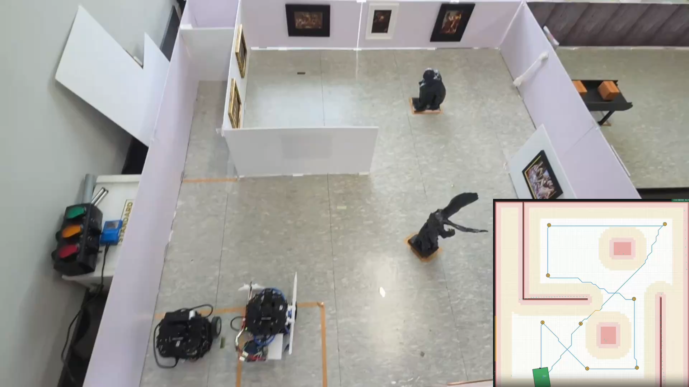
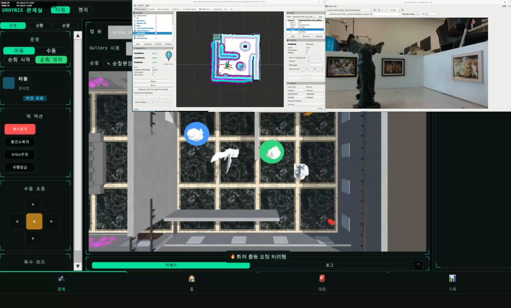
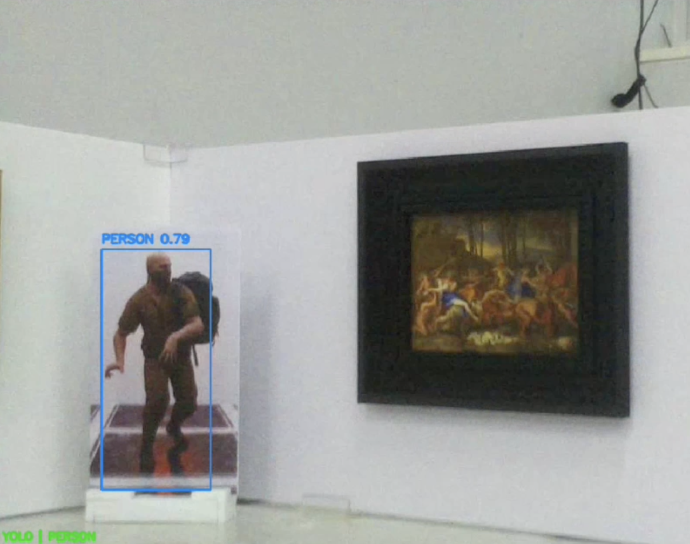

# URHYNIX Unity Dashboard

<p align="center">
  
</p>

<p align="center">
  두 대의 TurtleBot3, ROS 2, 비전·환경 센서, 순찰·출동 기록을<br />
  <strong>2D · 2.5D · 3D · Gallery</strong> 화면에서 연결하는 디지털 트윈 관제 클라이언트
</p>

| Unity | Robots | ROS bridge | Views |
|---:|---:|---:|---:|
| `6000.3.16f1` | T1 `tb3_1` · Gen.G `tb3_2` | robot별 TCP `10000` | `2D` · `2.5D` · `3D` · `Gallery` |

> 공개 Unity 프로젝트 정본은 저장소 루트의 `UNITY/`입니다.
>
> 기존 `ControlRoom*` 클래스·scene·namespace는 Unity 직렬화 호환성을 위해 유지합니다.

## 한 화면에서 관리하는 것

발표 자료의 Dashboard·Digital Twin 구성을 기준으로 실제 프로젝트의 화면 역할을 정리했습니다.

| 화면 영역 | 제공 기능 |
|---|---|
| 로봇 선택 | T1·Gen.G 전환, endpoint 연결 상태, 배터리와 하드웨어 정보 |
| 운영 | 자동·수동 모드, 순찰 시작·정지, 주행 준비와 복귀 |
| 지도 | 저장 map 선택, 2D·2.5D·3D·Gallery 시점 전환, pose·waypoint·event 표시 |
| 센서 | 카메라, LiDAR, PIR·소리·온도·레이저 상태 |
| 상황 대응 | 사건 위치 확인, 단발 출동, 정지와 운영자 피드백 |
| 기록 | session, event, dispatch, pose와 media metadata 조회 |

Unity Dashboard는 **상태·공간·사건을 시각화하고 운영자의 요청을 전달**합니다. AMCL·Nav2·DWB/RPP·Collision Monitor가 수행하는 실제 주행 판단은 robot-side ROS 2의 책임입니다.

## 시스템 아키텍처

<p align="center">
  
</p>

아키텍처 원본은 로컬에서 테마 전환과 PNG·SVG export를 지원합니다.

- [Interactive architecture HTML](./docs/architecture/urhynix-unity-architecture.html)
- [Archify source JSON](./docs/architecture/urhynix-unity.architecture.json)

핵심 데이터 흐름은 다음과 같습니다.

1. T1의 RealSense와 Gen.G의 Pi Camera·환경 센서가 robot-side ROS 2로 데이터를 전달합니다.
2. vision node와 robot bringup이 detection, pose, camera, LiDAR, sensor topic을 생성합니다.
3. ROS-TCP bridge가 로봇별 endpoint를 통해 Unity와 pub/sub를 연결합니다.
4. Unity는 지도·상태·사건·기록을 시각화하고 goal·waypoint·운영 명령을 전달합니다.
5. Nav2는 AMCL localization, global/local planning, collision safety와 실제 구동을 담당합니다.
6. session·event·dispatch·pose 기록은 Supabase audit trail로 연결됩니다.

## 발표 자료 기반 통합 화면

아래 이미지는 최종 발표 PPT에 사용된 원본 미디어에서 추출했습니다. 화면 캡처는 시스템 이해를 위한 시각 근거이며, 현재 실행 계약은 이 저장소의 코드와 설정 파일을 기준으로 합니다.

| 실물 공간과 디지털 트윈 | Unity · RViz · Camera 통합 |
|---|---|
|  |  |
| 실물 박물관 트랙, 로봇 배치와 지도 정합을 확인하는 시점 | Unity 관제, Nav2 상태, robot camera를 함께 확인하는 통합 시점 |

<p align="center">
  
</p>

<p align="center"><sub>박물관 환경의 vision detection capture</sub></p>

## 운영 시나리오 흐름

PPT의 System Flow와 Scenario 구성을 Unity 실행 경계에 맞춰 정리했습니다.

| 단계 | 시스템 동작 | Unity 표시 |
|---:|---|---|
| 1. 감지 | camera·LiDAR·환경 센서 또는 운영자 입력 | 선택 로봇과 sensor status |
| 2. 판정 | vision·sensor node가 결과 생성 | event와 위험도 |
| 3. 위치 확인 | map pose와 사건 좌표 결합 | 2D·2.5D·3D marker |
| 4. 출동 요청 | operator가 robot·목표를 선택 | dispatch 요청과 상태 |
| 5. robot-side 실행 | Nav2 goal·waypoint·recovery | 경로·pose·camera feedback |
| 6. 기록 | session·event·dispatch·pose 저장 | 기록 탭과 audit trail |

실제 운용에서는 Web Dashboard와 Unity Dashboard 중 **하나만 command owner**로 선택합니다.

## 주행·비전 기술 경계

| 영역 | 실제 실행 위치 | 사용 기술 |
|---|---|---|
| 위치 추정 | robot-side ROS 2 | saved map, AMCL, odometry, LaserScan, TF |
| 전역 계획 | robot-side Nav2 | SmacPlanner2D, clearance/widest-path preprocessing |
| 경로 추종 | robot-side Nav2 | DWB, feature branch의 Regulated Pure Pursuit |
| 안전 | robot-side Nav2 | costmap, obstacle·voxel·inflation, Collision Monitor |
| 정밀 접근 | robot-side package | ArUco `solvePnP`, rear LiDAR wall alignment |
| 비전 | robot 또는 integration host | YOLO, EfficientNet-B0, camera post-processing |
| 시각화·운영 | Unity | ROS-TCP, UI Toolkit, map/Gallery views, operator command |

`Assets/Scripts/Simulation/`의 demo 이동은 UI·발표 흐름 확인용이며 실제 주행 알고리즘의 근거로 사용하지 않습니다.

주행 구현 근거:

- [`main/src/urhynix_nav`](../src/urhynix_nav/) — AMCL·Nav2 설정, DWB, collision safety와 recovery
- [`feature/t1-rpp-patrol2-aruco-dock`](https://github.com/eduwing-robotics/ros2-ai-amr-repo2/tree/feature/t1-rpp-patrol2-aruco-dock) — T1 RPP 순찰·ArUco/LiDAR 정밀 접근
- [`feature/geng-rpp-patrol-aruco-dock`](https://github.com/eduwing-robotics/ros2-ai-amr-repo2/tree/feature/geng-rpp-patrol-aruco-dock) — Gen.G RPP 순찰·정밀 접근

## 기술 스택

| 항목 | 값 |
|---|---|
| Unity | `6000.3.16f1` · Unity 6.3 LTS |
| Render Pipeline | Universal RP `17.0.4` |
| UI | UI Toolkit |
| ROS bridge | ROS-TCP-Connector `v0.7.0`, embedded multi-endpoint patch |
| Input | Unity Input System `1.17.0` |
| Point cloud | `jp.keijiro.pcx` commit `ffc3447` |
| Robot domains | Gen.G `tb3_2` = `1`, T1 `tb3_1` = `2` |
| Endpoint | robot별 host의 TCP `10000` |
| Database | Supabase read + 제한된 operator write |

## 빠른 시작

1. Unity Hub에서 `6000.3.16f1`을 설치합니다.
2. **Add Project**로 저장소 루트의 `UNITY/`를 선택합니다.
3. 첫 import와 package restore가 끝날 때까지 기다립니다.
4. `Assets/Resources/RobotConfig/default_robots.json`에서 로봇 주소를 확인합니다.
5. `Assets/Resources/RosConfig/ros_endpoint.json`에서 시작 로봇을 선택합니다.
6. `Assets/Scenes/ControlRoomMain.unity`를 열고 Play합니다.

로봇 IP는 DHCP 환경에서 달라질 수 있습니다. 실행 전에 `hostAddress`, robot ID, domain, namespace와 실제 장비를 대조하세요.

## 프로젝트 구조

```text
UNITY/
├── Assets/
│   ├── Scenes/                    # ControlRoomMain, Demo
│   ├── Scripts/
│   │   ├── App/                   # 앱 상태·연결·이벤트 조립
│   │   ├── Ros/                   # robot별 pub/sub와 topic SSOT
│   │   ├── Map/                   # 2D·2.5D·3D 지도와 좌표 변환
│   │   ├── UI/                    # UI Toolkit view와 interaction
│   │   ├── Database/              # Supabase read·제한 write
│   │   └── Simulation/            # demo scenario
│   ├── Resources/                 # robot·sensor·situation·ROS config
│   ├── StreamingAssets/Maps/      # map slot과 preset
│   ├── UI/                        # UXML·USS·design token
│   └── Tests/EditMode/            # smoke tests
├── docs/
│   ├── images/                    # PPT 기반 screenshot과 architecture PNG
│   └── architecture/              # interactive HTML과 Archify source
├── Packages/manifest.json
├── ProjectSettings/
└── README.md
```

## 설정 정본

| 설정 | 파일 |
|---|---|
| 로봇 ID·역할·주소·camera/pose topic | `Assets/Resources/RobotConfig/default_robots.json` |
| 시작 endpoint 선택 | `Assets/Resources/RosConfig/ros_endpoint.json` |
| sensor topic | `Assets/Resources/SensorConfig/default_sensors.json` |
| situation과 demo 여부 | `Assets/Resources/SituationConfig/default_situations.json` |
| ROS topic 이름 | `Assets/Scripts/Ros/TopicRegistry.cs` |
| map image·좌표·preset | `Assets/StreamingAssets/Maps/` |

토픽이나 주소를 C# 여러 곳에 직접 쓰지 말고 위 설정과 `TopicRegistry`를 먼저 수정하세요.

## 보안과 운영 안전

- Supabase `service_role` 키를 Unity나 Git에 넣지 않습니다.
- 공개 가능한 anon 설정만 사용하고 로컬 secret은 `.gitignore`로 차단합니다.
- 두 로봇 또는 두 Dashboard가 동시에 명령을 발행하지 않도록 command owner를 하나로 제한합니다.
- 주소, domain, namespace가 불명확하면 주행 명령을 보내지 않습니다.
- 실제 주행 전 배터리·비상정지·주변 장애물·선택 robot ID를 확인합니다.

## 검증

저장소 루트에서:

```bash
python3 -m py_compile \
  src/urhynix_slam/make_pretty_map_slot.py \
  src/urhynix_slam/pgm_to_map_slot.py

rg -n 'client/UNITY|client/ControlRoom|unity/ControlRoom' . \
  --glob '!UNITY/README.md' \
  --glob '!UNITY/BRANCH-AUDIT.md'

git diff --check
```

Unity Editor가 설치된 환경에서는 프로젝트 compile error가 없는지 확인하고 EditMode smoke를 실행하세요.

## 브랜치 감사

Unity 프로젝트의 브랜치별 중복·고유 변경과 삭제 판정은 [`BRANCH-AUDIT.md`](./BRANCH-AUDIT.md)에 기록했습니다.
